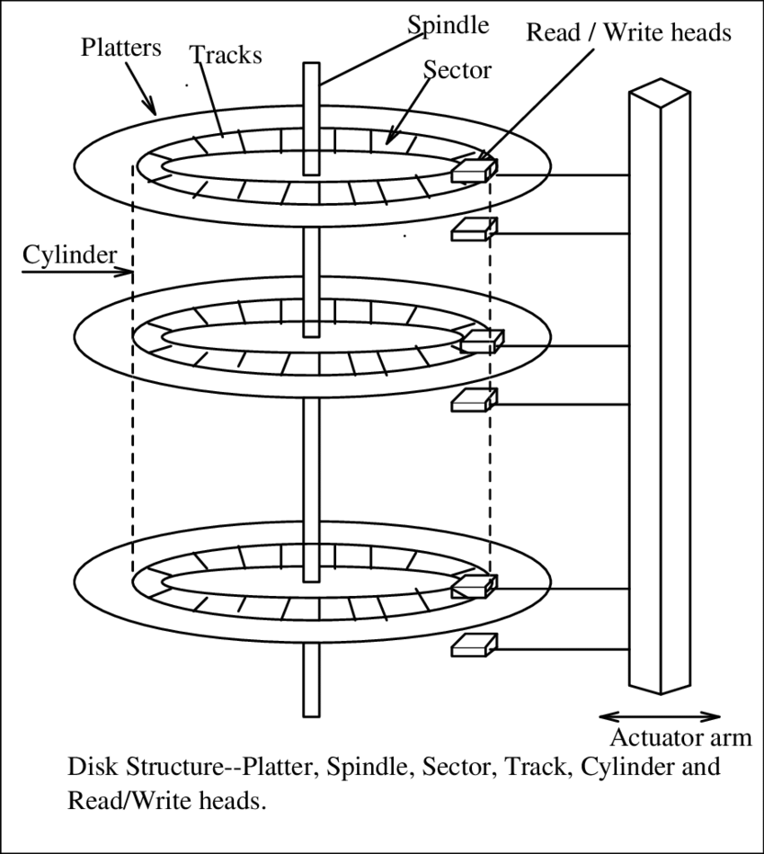
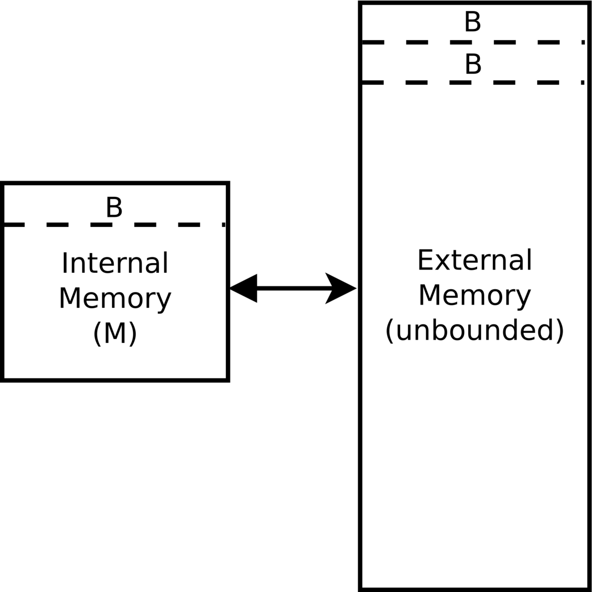

## Реальный компьютер

Когда мы вводили RAM-модель, мы говорили о том, что она обладает кучей проблем, в числе которых была проблема с тем, что Random Access и Sequential Access не являются одинаковыми по времени. А если мы захотим и вовсе читать с диска, а не из RAM (потому что данных очень много), то разрыв увеличится еще сильнее. Поэтому чтобы построить более реалистичную модель оценки времени алгоритма для больших данных, мы введем модель внешней памяти, однако для начала подробнее поговорим обо всём в числах.

## "Современные" числа

Я буду оперировать примерными числами 2025-го года. Теперь расскажу о том, что мы хотим замерять и что нам реально важно:

1. Четыре типа памяти:
   * L1 Cache - самый быстрый кэш процессора - данные лежат прямо на кристалле, это lower bound на вообще теоретически возможное время доступа к данным
   * RAM (оперативная память) - это то, что мы использовали в RAM-модели, это память, которая доступна процессору и в которой мы можем хранить данные
   * SSD/Flash (твердотельный накопитель) - это современный способ хранения данных на "диске". Его преимущество в том, что он быстрее, чем HDD и дешевле, чем RAM
   * HDD (жесткий диск) - это "старый" способ хранения данных, который медленнее SSD, но дешевле. Он используется в основном для хранения больших объемов данных, которые не требуют быстрого доступа.
2. Про каждый из типов памяти нас интересует три параметра:
   * **space** - это объем памяти, который мы можем использовать.
   * **latency** - это безусловное время доступа к данным, которые лежат в произвольном месте памяти. Проще всего объяснить этот параметр на примере HDD. HDD представляет из себя вращающийся диск и магнитную головку, которая считывает данные. Если мы хотим прочитать данные с HDD, то нам нужно подождать, пока диск ФИЗИЧЕСКИ повернется и головка найдет нужные данные. Это время называется latency. Важно понимать, что latency - это не время, которое мы ждем, пока данные будут прочитаны, а время, которое мы ждем, пока диск повернется и головка найдет нужные данные. Аналогичные ограничения есть и для любого другого типа памяти, однако они более сложны и зависят больше от инженерных особенностей.
   * **bandwidth** - это скорость передачи данных между памятью и процессором при условии последовательного доступа к данным.

{:width="30%"}

В современное железе на один сервер обычно приходится несколько дисков, поэтому мы будем это писать как $X$ Tb x $Y$, где $Y$ - количество дисков.

|  | L1 Cache | RAM | SSD | HDD |
|-----------|-----|-----|-----|-----|
| space     | 32 Kb | 1 Tb | 10 TB x 10 | 20 Tb x 50 |
| latency   | 1 ns | 30 ns | 100 us | 4 ms |
| bandwidth | - | 200 GB/s | 14 GB/s | 500 Mb/s |

Исходя из такой таблицы мы можем понять, что доступ к SSD на несколько порядоков медленнее, чем к RAM, поэтому когда мы будем оценивать время работы алгоритма, работающего с Externam Memory (память, которая не является RAM), мы **будем оценивать количество операций доступа к external memory**. Конечно, мы можем и учесть время работы самого алогитма внутри RAM и добавить с каким-то коэффициентом, но это будет крайне малый коэффициент и значительно усложнит оценку, существенно не увеличивая ее точность.

На замечательной странице от Colin Scott можно найти [историческую интерактивную визуализацию](https://colin-scott.github.io/personal_website/research/interactive_latency.html) времени доступа к разным видам памяти и сравнить ее друг с другом.

## Модель внешней памяти

### Параметры модели: $M$, $N$ и $B$

Модель внешней памяти (англ. _External Memory Model (EM model)_) - это модель, которая позволяет оценивать время работы алгоритма, работающего с данными, которые хранятся на внешнем носителе (например, на жестком диске или SSD). В этой модели мы будем иметь три параметра:

1. $M$ - размер оперативной памяти
2. $N$ - размер входных данных, подразумеваем, что $N >> M$
3. $B$ - размер блока данных, который мы можем прочитать за один доступ ко внешней памяти. Минимальное предположение: $M > 2B$, хотя иногда полезным будет более сильная оценка $M > B^2$, что выполняется на практике. Объясним природу этого параметра отдельно.

Заметим, что чтобы прочитать $x$ последовательных элементов из внешней памяти в RAM, нам нужно $T_{read}(x)$ времени, где

$$ T_{read}(x) = latency + \frac{x}{bandwidth} $$

Из этой формулы легко сделать вывод, что читать по одному элементу - это крайне неэффективно, поскольку каждый раз нам придется ждать $latency$ времени. Поэтому удобно за раз прочитать много последовательных элементов, относительно начального. Поэтому для расчета "неплохого" $B$ - количества последовательных элементов для чтения за раз - можно приравнять время задержки и количество данных, которые мы можем последовательно вычитать за это время, получим стандартные числа в районе 100Kb-1Mb.

### Оценка времени работы алгоритма

В модели внешней памяти мы будем оценивать время работы алгоритма по количеству операций ввода-вывода между внутренней и внешней памяти, не учитывая время работы внутри RAM (поэтому модель иногда называют _input-output (io) model_). Формально говоря, нам доступы только две операции, выполняющиеся за $O(1)$ времени:

* $Read(i, b)$ - это операция чтения блока данных длины $b \leq B$ из внешней памяти в RAM, начиная с позиции $i$.
* $Write(i, b)$ - это операция записи блока данных длины $b \leq B$ из RAM во внешнюю память, начиная с позиции $i$.
* **Любые** операции в RAM мы будем считать за $O(1)$ времени, даже NP-сложные задачи! Никакие операции кроме чтения и записи не доступны во внешней памяти.

{:width="30%"}

## Сумма во внешней памяти

Рассмотри задачу, в которой в модели внешней памяти нам нужно посчитать сумму чисел в массиве, находящемся во внешней памяти. Тогда мы можем разбить наш массив на блоки по $B$ элементов, загружать их последовательно в RAM и считать сумму. Таким образом мы получим $\lceil \frac{N}{B} \rceil$ чтений из внешней памяти, то есть время работы алгоритма будет $O(\frac{N}{B})$.

Еще раз обратите внимение, что мы никак не учитываем время работы алгоритма внутри RAM, там мог бы быть хоть квадрат, хоть задача коммифояжера - это было бы не важно.

## О времени работы произвольного алгоритма во внешней памяти

Легко понять, что если у нас есть алгоритм, который работает за $T(n)$ времени в RAM, то мы можем повторить его за $T(n)$ в EM модели, но тогда мы совсем не пользовались тем, что у нас есть возможность работать с блоками размера $B$ за раз, то есть $T(n)$ будет верхней оценкой в EM-модели.

Нижней оценкой очевидно будет $T(\frac{N}{B})$, за счет того что мы можем "объединить" $B$ операций чтения в одну, как это было сделано в примере со сложением. В реальности же время работы алгоритма обычно будет где-то между этими двумя оценками:

$$ \frac{T(N)}{B} \leq T_{EM}(N) \leq T(N) $$
