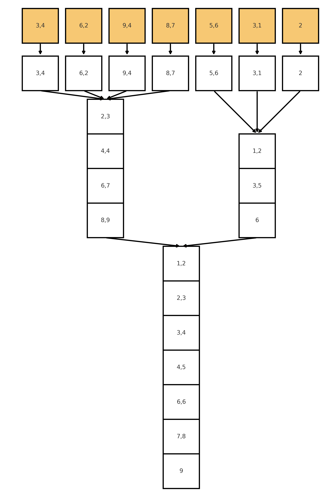
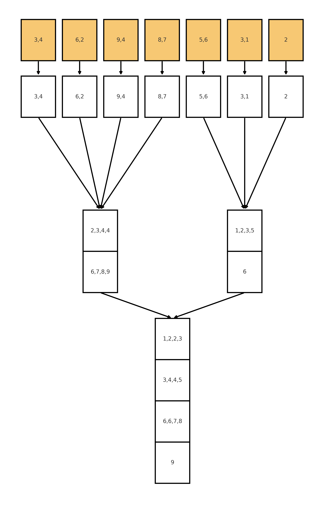
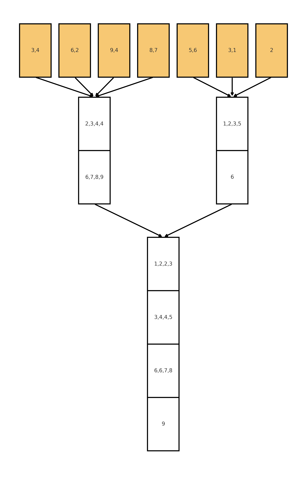

Предположим, что мы хотим отсортировать очень длинный массив, который не помещается в оперативную память, иначе говоря, отсортировать массив во внешней памяти. Для этого вспомним топ-3 ваши любимые сортировки и попробуем адаптировать их к модели внешней памяти:

1. Quick sort
2. Merge sort
3. Heap sort

Heap sort мы сразу откинем (но оставим в качестве упражнения в конце), поскольку для него нужен random access, а в модели внешней памяти это было бы очень больно.

Quick sort неплох - в нем не нужен random access, но отложим его на потом, поскольку его сложнее будет адаптировать.

## Merge sort

### Merge

Эта сортировка отлично адаптируется к модели внешней памяти. Начнем с merge: имея два отсортированных блока размера $L$ и $R$ во внешней памяти, мы можем их слить в один отсортированный блок за $O(\lceil \frac{L + R}{B} \rceil)$, двигаясь двумя указателями аналогично обычному merge.

### Simple External Memory Merge Sort

Используя наш merge, сортировка будет работать следующим образом:

1. На нулевой итерации вычитаем все блоки размера $B$ и отсортируем их внутри RAM
2. На первой итерации сольем пары подряд идущих блоков размера $B$ в один отсортированный размера $2B$ используя merge
3. На третьей итерации сольем пары подряд идущих блоков размера $2B$ в один отсортированный размера $4B$ используя merge
4. И так далее, пока не отсортируем весь массив

Пример для сортировки с $B=2$:

{{:width="30%"}}

То есть всего будет $O(\log_B \frac{N}{B})$ уровней и на каждом уровне мы будем делать $O(\frac{N}{B})$ операций чтения, то есть общее время работы алгоритма будет $O(\frac{N}{B} \log_B \frac{N}{B})$.

### Улучшаем (K-way Merge)

Мы не пользовались тем, что у нас есть $M$ оперативной памяти, а не только $B$. Поэтому мы можем вместо того, чтобы сливать лишь пары блоков, слить сразу $\frac{M}{B}$ блоков в один (тогда мы будем использовать $O(M)$ оперативной памяти). Тогда глубина дерева сортировки уменьшится до $O(\log_{\frac{M}{B}} \frac{N}{B})$, а общее время работы алгоритма будет $O(\frac{N}{B} \log_{\frac{M}{B}} \frac{N}{B})$.

Предположим, что мы имеем $M=8$, тогда за раз мы можем сливать до 4 блоков размера $B=2$:

{{:width="30%"}}

И последний шаг - мы можем оптимизировать нулевой уровень и начать сразу сортировать блоки размера $M$, а не $B$ в RAM (это повлияет только на константу, но на практике конечно крайне важно). Тогда общее время работы алгоритма будет $O(\frac{N}{B} \log_{\frac{M}{B}} \frac{M}{B})$.

{{:width="30%"}}

Оказывается, что такая сортировка будет оптимальной по асимптотике среди сортировок сравнениями. Мы докажем это в одном из следующих разделов.

## Упражнения

1. Адатируйте quick sort к модели внешней памяти, добиавшись той же асимптотики, что и у merge sort. Для этого вам придется придумать K-way partitioning во внешней памяти.
2. Удалите из массива все дубликаты за время $O(\max(\frac{N}{B}, \frac{N}{B} \log_{\frac{M}{B}} \frac{N}{B} - \sum_{i=1}^{K} \frac{N_i}{B} \log_{\frac{M}{B}} \frac{N_i}{b}))$, где $K$ - количество уникальных элементов, $N_i$ - количество вхождений $i$-го уникального элемента.
3. Придумайте эффективную кучу во внешней памяти, поддерживающую операции insert и delete-min за $O(\frac{1}{B}\log_{\frac{M}{B}} \frac{N}{B})$ амортизировано.

Идея для п.3

Куча будет иметь $\frac{M}{B}$ детей вместо 2 и хранить в каждом узле $M$ минимальных элементов вместо одного. Для эффективной вставки буферизуем $M$ элементов и вставляем их в кучу батчём после заполнения буфера.

## Ссылки

1. Лекции Максима Бабенко в Школе Анализа Данных Яндекса
2. Конспекты [часть 1](https://www.slideserve.com/tallys/i-o-algorithms), [часть 2](https://www.cs.helsinki.fi/hecse/events/sada07/lectures/slides/Arge_SADA07large.pdf) профессора Lars Arge из Aarhus University
