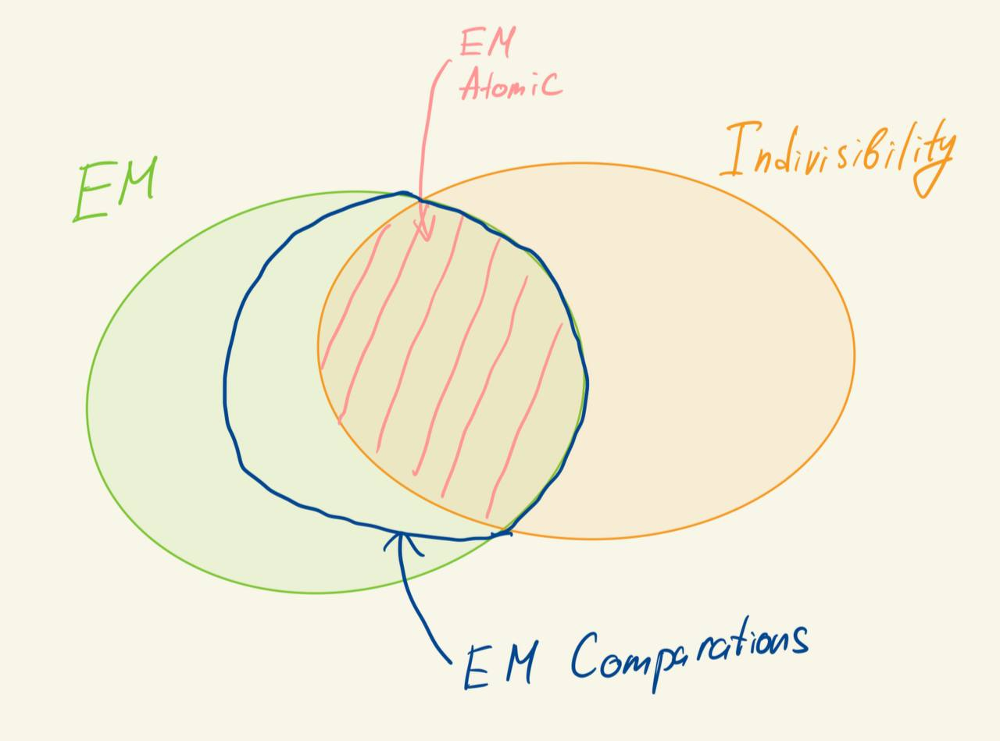

## Задача

В RAM-модели переставить элементы в массиве (англ. _permutation problem_) - это простейшая задача, в которой нужно по заданному массиву $a_n$ и перестановке $\pi(n)$ построить массив $b_k = a_{\pi(k)}$. Такая задача решается за $O(n)$ в RAM-модели, однако в модели внешней памяти (EM модель) мы получим более эффективный алгоритм и даже докажем его оптимальность по модулю некоторых предположений.

Пусть в EM модели есть массив размера $N$, который нужно переставить согласно заданной перестановке $\pi(n)$, тогда существует алгоритм, время работы которого $O(\min(N, \frac{N}{B} \log_{\frac{M}{B}} \frac{N}{B}))$. Более того, если модель удовлетворяет **indivisibility assumption**, то быстрее нельзя.

## Что такое indivisibility assumption?

Indivisibility assumption - это по сути другая модель внешней памяти, которая с одной стороны крайне похожа на EM модель, но с другой - имеет несколько ключевых различий. В Indivisibility Model мы будем иметь всё те же три параметра $M$, $N$ и $B$, однако набор операций чуть-чуть отличается:

* $Read(e, B)$ - это операция чтения блока данных из внешней памяти в котором содержится элемент $e$
* $Write(e, B)$ - это операция записи блока данных во внешнюю память, в котором содержится элемент $e$
* Все операции над элементами в RAM **неизменяемые (atomic)** и выполняются за $O(1)$, то есть вы не можете менять элементы из инпута - они являются "неделимыми" единицами информации.
* Для простоты анализа мы будем разрешать оперировать только целиком блоками размера $B$

С одной стороны данная модель сильнее, чем EM модель, поскольку она умеет  **волшебным образом** доставать нужный вам элемент из произвольного места во внешней памяти без полного ее сканирования. С другой стороны она слабее, поскольку не позволяет вам делать произвольные операции над элементами массива, а только операции чтения и записи.

Для наглядности понимания того, как соотносятся EM модель и Indivisibility модель предлагаю сузить EM модель до EM atomic model - EM модели, в которой нельзя выполнять произвольные операции над элементами. В таком случае легко осознать, что мы получили пересечение EM модели и Indivisibility модели. Кроме того, можно легко представить EM comparison model - это почти EM atomic model, но с дополнительно операцией сравнения двух элементов (она пригодится нам дальше для доказательства оптимальности сортировки). Диаграма доступных операций в разных моделях будет выглядеть следующим образом:

{:width="50%"}

Indivisibility assumption - удобная модель для нижней оценки времени работы алгоритма, которая позволяет нам не задуматься о том, какие операции доступны над элементами массива. В общем случае **для EM модели до сих пор не существует хорошей нижней оценки на время работы алгоритма перестановки**.

## Доказательство

### Построение алгоритма

Есть два простейших алгоритма, которые решают эту задачу: мы можем в лоб, как в RAM-модели, пройтись по массиву и записать элементы в нужные места, это будет случай с $O(n)$ оценкой. Второй случай - это отсортировать массив пар $(\pi(i), a_i)$, что займет $O(\frac{N}{B} \log_{\frac{M}{B}} \frac{N}{B})$, таким образом мы получим верхнюю оценку на время работы алгоритма как минимум из двух алгоритмов. Важно заметить, что оба алгоритма удовлетворяют indivisibility assumption.

### Оптимальность

**Шаг 1.** Зафиксируем произвольный алгоритм перестановки, пусть в худшем случае для какой-то фиксированной перестановки он совершил $H$ операций чтения и записи. Далее мы можем рассматривать лишь алгоритмы с $H \leq n^2$, в противном случае нижняя оценка уже $\Omega(n^2)$, которая сильнее той, что мы хотим доказать.

**Шаг 2.** Будем думать о блоке длины $B$ как о **неупорядоченном (мульти)множестве**, поскольку за 1 операцию мы можем загрузить его во внутреннюю память и расставить в произвольном порядке. Поэтому мы будем называть блок **использованным**, если блок, как неупорядоченное множество, уже передавался из внешней памяти во внутреннюю или наоборот.

**Шаг 3.** Определим **состояние** алгоритма, как набор некоторых мультимножеств: первое мультимножество - это вся внутянняя память (поскольку мы мы можем ее упорядочить как нам вздумается), после него будут идти все когда-либо использованные блоки в течение работы алгоритма (правда эти блоки мы можем менять операцией вывода).

**Шаг 4.** По определению $H$ количество мультимножеств в состоянии алгоритма не превосходит $H$ (иначе мы за одну операцию ввода-вывода добавили в состояние больше $1$ мультимножества, что невозможно).

**Шаг 5.** Как может меняться состояние алгоритма в зависимости от операции?

* Read - мы вытаскиваем произвольный блок из состояния (не больше $H$ вариантов) и вставляем его в произвольное место внутренней памяти (в точности $C_{M}^B$ вариантов).
* Write - мы вытаскиваем произвольный блок из внутренней памяти (в точности $C_{M}^B$ вариантов) и вставляем его в произвольное место состояния между существующими блоками (не больше $H$ вариантов) или заменяем произвольный блок состояния (еще не больше $H$ вариантов).

Итого после одной произвольной операции состояние может стать одним из $3H C_M^B$ возможных. Соответственно после $H$ операций состояние может стать одним из $(3H C_M^B)^{H}$, а имея $H < n^2$ получаем верхнюю оценку в $(3n^2 C_M^B)^{H}$.

**Шаг 6.** Алгоритм обязан уметь генерировать каждую из возможных перестановок. Всего перестановок $n!$, но различаемых из них всего лишь $\frac{n!}{(B!)^{\frac{N}{B}}}$, поскольку блоки размера $B$ не различимы (с точки зрения того, что блоки размера $B$ могут быть переставлены за 1 операцию).

**Шаг 7.** Таким образом, мы получили неравенство: количество возможных состояний алгоритма (как его выход) должно быть больше количества различимых перестановок, то есть:

$$
(3n^2 C_M^B)^{H} \geq \frac{n!}{(B!)^{\frac{N}{B}}}
$$

Или, взяв логарифм:

$$
H \ln \left((3n^2)C_M^B\right) \geq \ln n! - \frac{N}{B} \ln B!
$$

Мы получим оценку на $H$ с помощью оценки факториала формулой Стирлинга снизу и $n^n$ сверху:

$$
n \ln n - n < \ln n! < n \ln n
$$

И, как следствие, опуская технические детали, $\ln C_n^k \geq k \ln \frac{n}{k} - n$.

Тогда левую часть без $H$ мы можем оценить снизу как:

$$ \ln \left((3n^2)C_M^B\right) \geq \ln 3n^2 +  B \ln \frac{M}{B} $$

А правую часть неравенства оценить сверху как:

$$
\frac{n!}{(B!)^{\frac{N}{B}}} \leq N \ln \frac{N}{B} + N \leq 2 N \ln \frac{N}{B}
$$

Таким образом мы получили неравенство:

$$
H \left(\ln 3n^2 + B \ln \frac{M}{B} \right) \geq 2 N \ln \frac{N}{B}
$$

Или

$$
H \geq \frac{2N \ln \frac{N}{B}}{\ln 3n^2 + B \ln \frac{M}{B}}
$$

Осталось рассмотреть два случая:

1. $\ln 3n^2 > B \ln \frac{M}{B}$ - тогда оцениваем знаменталь как $2 \ln 3n^2$, а вся дробь, опуская константы, $\frac{N \ln \frac{N}{B}}{\ln N} \leq N = \Omega(N)$ случай
2. $B \ln \frac{M}{B} > \ln 3n^2$ - тогда оцениваем знаменталь как $2B \ln \frac{M}{B}$, а вся дробь $\frac{N \ln \frac{N}{B}}{B \ln \frac{M}{B}} = \frac{N}{B} \log_{\frac{M}{B}} \frac{N}{B}$ по свойствам логарифмов, получили второй случай $\Omega(\frac{N}{B} \log_{\frac{M}{B}} \frac{N}{B})$.

Таким образом, мы получили два случая, которые в точности совпадают с нижней оценкой времени работы алгоритма, который мы получили примером в начале.

## Ссылки

1. [Конспекты](https://citeseerx.ist.psu.edu/document?repid=rep1&type=pdf&doi=3e8ee3d1f8920a99f78d3e6de5ffe7406b085d52) профессора Yufei Tao из Chinese University of Hong Kong
2. Оригинальная работа A. Aggarwal and J. S. Vitter. The input/output complexity of sorting and related problems.
CACM, 31(9):1116–1127, 1988.
