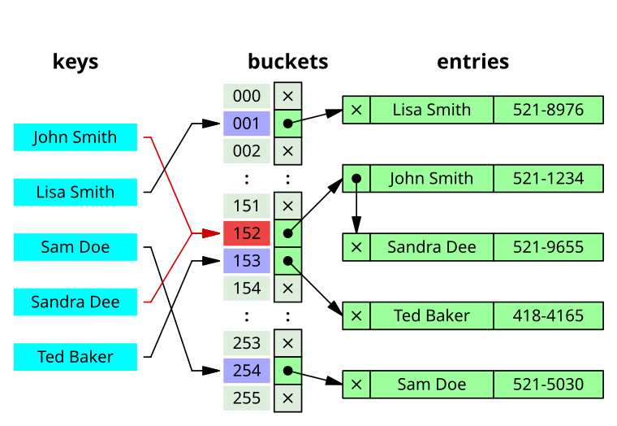

Хеш-таблица - это структура данных, которая позволяет производить операции вставки, удаления и поиска за $O(1)$ в среднем.

Мы можем сравнить эту структуру с `std::set` - он позволял делать все те же операции за $O(\log n)$, но дополнительно сортировал все элементы. Хеш-таблицы же не сортируют элементы, а хранят их в некотором случайном порядке, что позволяет делать операции быстрее.

В C++ хеш-таблицы реализованы в `std::unordered_set` и `std::unordered_map`. В Python аналогом является `dict`, который также использует хеш-функции для быстрого доступа к элементам.

## Идея

Предположим, что мы хотим хранить $N$ целых чисел, которые могут принимать значения от $0$ до $A-1$. Тогда мы можем использовать массив размера $A$ и хранить в нем числа, используя их значение в качестве индекса. Однако если $A$ значительно больше $N$ (например, $A = 10^9$, $N = 10^5$), то это будет неэффективно с точки зрения памяти - мы просто не сможем создать такой большой массив.

Поэтому мы будем использовать хеш-функцию, которая будет отображать числа из диапазона $[0, A-1]$ в диапазон $[0, M-1]$. Таким образом, мы сможем хранить числа в массиве размером $M$, а хеш-функция будет использоваться для вычисления индекса в этом массиве.

Простейшей хеш-функцией является

$$
h(x) = x \bmod M
$$

Но во избежании легко строящихся коллизий мы будем использовать линейное преобразование:

$$
h(x) = (ax + b) \bmod M
$$

для $a \neq 0$.

## Проблема

Чтобы решить проблему большим количеством памяти, мы будем брать $M \approx N$, а точнее $M = \alpha N$, где $\alpha$ будет называться коэффициентом загрузки - заранее выбранная и фиксированная константа. Очевидно, что у нас будут коллизии - разные ключи будут отображаться в один индекс ведь по парадоксу дней рождений хорошо было бы иметь квадрат памяти для их отсутствия, но мы не можем себе такого позволить! Давайте научимся решать проблему коллизий. Существует множество методов разрешения коллизий, мы рассмотрим метод цепочек и открытую адресацию.

### Метод цепочек

Метод цепочек (англ. _chaining_) заключается в том, что мы будем хранить в каждой ячейке массива, теперь называемой _bucket_, не одно значение, а список значений с одинаковым хешом. Таким образом, если несколько ключей отображаются в один индекс, то они будут храниться в одном списке.

{width="50%"}

### Открытая адресация

Метод открытой адресации (англ. _open addressing_) заключается в том, что мы будем хранить все элементы в одном массиве, а при коллизии будем искать _следующую свободную_ ячейку в массиве.

{width="50%"}

Для удобства дальнейших рассуждений мы будем думать о методе цепочек, хотя более эффективным по константе является метод открытой адресации.

## А что со временем работы?

Теперь время каждой операции будет зависеть от длины цепочки в бакете. То есть, если в бакете $L$ элементов, то время работы вставки/поиска/удаления будет $O(L)$. Оказывается, что средняя длина цепочки будет $O(1)$ (более точно, $\Theta(\alpha)$), поэтому в среднем время работы будет $O(1)$. Вы можете самостоятельно это доказать, в предположении, что хеш-функция равномерно случайно распределяет ключи по бакетам. Однако в следующем разделе мы проведем честные оценки и докажем математическую базу хешей, которая в точности докажется оценку $O(1)$.
