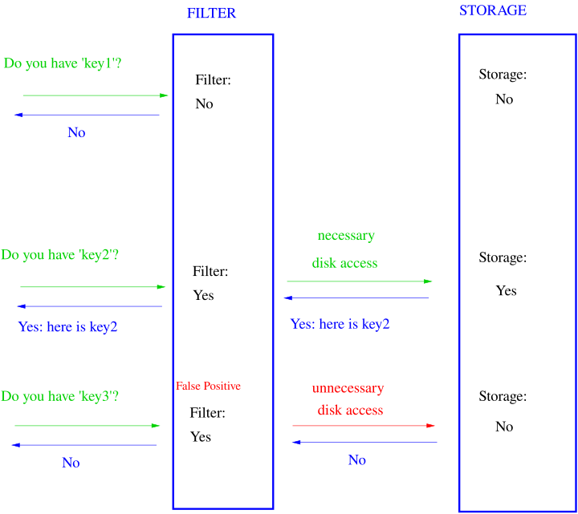
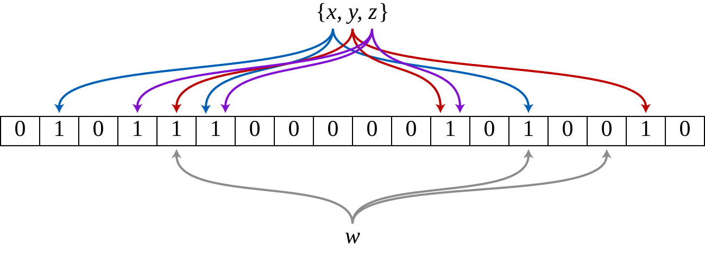

## Свойства

Фильтр Блума - это структура данных, которая позволяет проверять, принадлежит ли элемент множеству или нет за $O(1)$ в ХУДШЕМ случае с возможностью вставки и удаления. Однако в отличии от хеш-таблиц он не будет гарантировать 100%-ную точность.

Чуть более подробно - фильтр будет гаратнтировать, что если элемент принадлежит множеству, то структура гарантированно вернет `true`, а если не принадлежит, то с некоторой вероятностью ошибется.

Другой важной особенностью является то, что фильтр Блума не будет явно хранить элементы, то есть какими бы тяжелыми не были элементы, вы всегда будете тратить только $O(1)$ памяти вместо их реального размера!

## Практика

С учетом всех замечательных свойств фильтра Блума, он **массово применяется** в реальных задачах. Например, он используется в поисковых системах для проверки, есть ли страница в индексе или нет: сначала запрос идет в фильтр Блума и только если он вернет `true`, то запрос идет в хеш-таблицу, которая хранит все страницы.

{:width="50%"}

Также фильтр Блума используется в системах контроля версий, например, в Git, для проверки, есть ли файл в репозитории или нет. Кроме того, фильтр Блума используется в системах распределенного хранения данных, например, в Apache Cassandra и Amazon DynamoDB, для проверки, есть ли данные в кластере или нет.

## Устройство

Фильтр Блума состоит из массива битов заранее фиксированного размера $M$ и $k$ хеш-функций, которые отображают элементы в диапазон от $0$ до $M-1$.

* При вставке элемента мы вычисляем $k$ хешей для него и устанавливаем соответствующие биты в массиве в `1`.
* При проверке принадлежности элемента множеству мы вычисляем $k$ хешей для него и проверяем, установлены ли соответствующие биты в массиве в `1`. Если все биты установлены, то считаем, что элемент принадлежит множеству, иначе - не принадлежит.

{:width="70%"}

Как мы видим из схемы, фильтр Блума действительно может иметь только ложноположительные ошибки, но не может иметь ложноотрицательных.

Упраженение: а как поддерживать удаления из фильтра Блума?

## Вероятность ошибки

Структура данных удивительно проста, но какая же вероятность ложноположительного срабатывания?

Пусть $N$ - количество элементов в фильтре, $M$ - размер массива битов, $k$ - количество хеш-функций. Предположим, что что хеш-функции равеномерно случайно выдают числа от $0$ до $M-1$, то есть:

$$ P[h_i(x) = t] = \frac{1}{M} $$

Тогда вероятность того, что $t$-й бит не уставлен в `1` при вставке одного элемента будет равна:

$$ P[h_1(x) \neq t, \ldots, h_k(x) \neq t] = \left(1 - \frac{1}{M}\right)^k $$

А вероятность того, что $t$-й бит не уставлен в `1` при вставке всех $N$ элементов будет равна:

$$ P[\forall x \in A: h_1(x) \neq t, \ldots, h_k(x) \neq t] = \left(1 - \frac{1}{M}\right)^{kN} $$

Что при достаточно большом $M$ по второму замечательному пределу примеро равно:

$$ P[\forall x \in A: h_1(x) \neq t, \ldots, h_k(x) \neq t] \approx e^{-\frac{kN}{M}} $$

Ложноположительное срабатывание будет происходить, если все $k$ бит установлены в `1`, то есть с вероятностью:

$$ P[\text{false positive}] \approx \left(1 - e^{-\frac{kN}{M}}\right)^k $$

Мы можем оптимизировать данную формулу по $k$, найдя оптимальное количество хеш-функций:

$$ k = \frac{M}{N} \ln 2 $$

Тогда сама вероятность ложноположительного срабатывания будет равна:

$$ P[\text{false positive}] \approx 0.61^{\frac{M}{N}} $$

То есть уже при $M=10N$, что соответствует 10 битам на каждый элемент, вероятность ложноположительного срабатывания будет равна $0.61^{10} \approx 0.007$, что уже очень сильно!

## Ссылки

1. Фильтр Блума на [Wikipedia](https://en.wikipedia.org/wiki/Bloom_filter)
