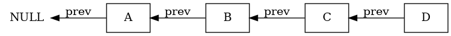
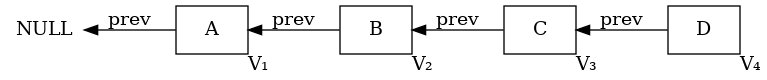
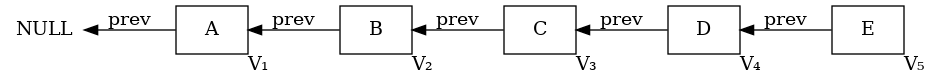
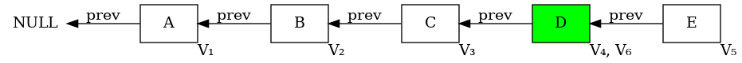
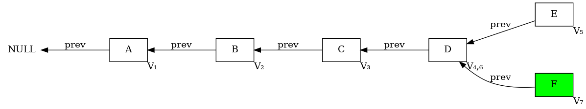

В этом разделе мы будем думать о стеке, как о частном случае односвязного списка. А именно, пустой стек - это пустой односвязный список, операция `push` - это добавление элемента в конец списка, `pop` - это удаление элемента из конца списка, а `top` - это получение элемента из конца списка.

```cpp
struct Node {
    int value;
    Node *next;
};

struct Stack {
    Node *top;

    Stack() : top(nullptr) {}

    void push(int x) {
        Node *newNode = new Node();
        newNode->value = x;
        newNode->next = top;
        top = newNode;
    }

    void pop() {
        Node *oldTop = top;
        top = top->next;
        delete oldTop;
    }

    int top() {
        return top->value;
    }
};
```



Теперь сделаем такой стек персистентным. Мы начнем делать стек частично персистентным, однако в конце он окажется полностью персистентным.

## Операция `push`

Теперь при операции `push` мы будем создавать новый узел, как и раньше, но добавится лишь одно отличие - мы пометим эту вершину как версию стека $V_{k+1}$, если сейчас у нас есть $k$ версий.



Добавим новую вершину:



При этом мы можем заглянуть в любую версию стека по индексу $k$ и узнать её `top` - то есть для операций `push` и `top` мы уже реализовали частичную персистентность.

## Операция `pop`

Обычно в стеке при операции `pop` мы просто удаляем элемент из конца стека - его последнюю вершину в списке, однако теперь в нашем случае мы не можем просто взять и удалить элемент из памяти насовсем, ведь нам нужно так или иначе иметь доступ ко всем версиям стека, в том числе и к версии, в которой есть этот элемент. Поэтому мы лишь сдвинем указатель на `top` стека на один элемент назад, не удаляя его из памяти, не забыв пометить при этом текущую вершину как версию $V_{k+1}$. На картинке ниже поментим `top` зеленым цветом, чтобы не потерять его.



Но тут у нас сломается `push` - ведь раньше мы добавляли элемент в конец стека, создавая новый узел в односвязном списке, а теперь новый узел уже может быть "занят" какой-то (удаленной) вершиной, а нашем случае вершиной $E$.

Поэтому мы перейдем от "линейной" структуры - односвязного списка, к древовидному, а именно теперь каждая вершина может иметь несколько "следующих" элементов в стеке - из разных версий, - но всё ещё каждая вершина будет указывать только на одну предыдущую вершину.



Удивительно, но это всё, что нам нужно сделать - то есть персистентный стек - это всего лишь корневое дерево. Более того, мы получили fully persistent stack, то есть никто нам не мешает откатиться в произвольную версию стека и делать `push` и `pop` из неё - добавится лишь новая вершина в дереве.

### Реализация

```cpp
struct Node {
    int value;
    Node *prev;
}

struct PersistentStack {
    Node *top;
    vector<Node*> versions;

    PersistentStack() : top(nullptr) {}
    void push(int x) {
        Node *newNode = new Node();
        newNode->value = x;
        newNode->prev = top;
        top = newNode;
        versions.push_back(newNode);
    }
    void pop() {
        Node *oldTop = top;
        top = top->prev;
        versions.push_back(oldTop);
    }
    int top() {
        return top->value;
    }
    Node* reversion(int k) {
        return versions[k];
    }
};
```
