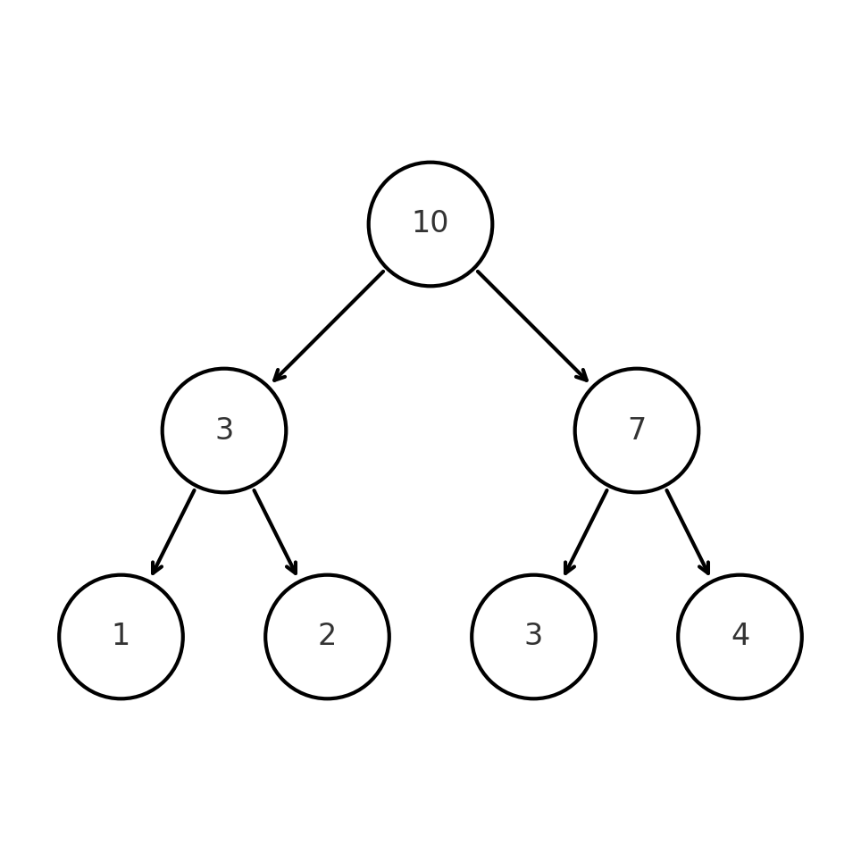
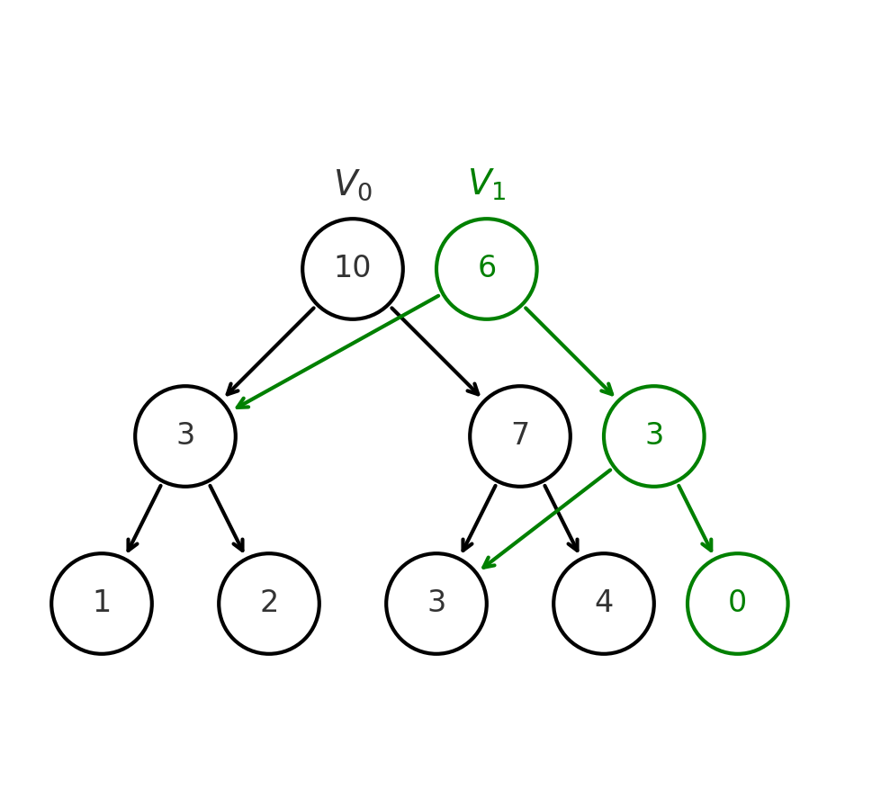

## Задача

Это раздел мы начнем с красивой задачи, которая будет решаться с помощью персистентного дерева отрезков, а именно нахождения количества различных чисел на отрезке $[l, r]$. Казалось бы, при чем тут персистентность?..

### Решение

Считаем и сохраним все запросы $l_i, r_i$ и сгруппируем их по значению $r$, чтобы обрабатывать их по отдельности.

Можете ли вы решить задачу за $O(\log n)$ на запрос при фиксированном $r$? Рекомендую посидеть над этим хотя бы 10 минут, прежде чем смотреть подсказки или решение.

<details markdown="1">
<summary>Решение для фиксированного $r=k$</summary>
Построим вспомогательный массив $b$, который будет состоять из нулей и единиц, где единицами будут отмечены последние вхождения чисел в массиве от $1$-го до $r$-го. Например, если массив $a = [4, 1, 2, 1, 3]$, $r=4$, то $b = [1, 0, 1, 1, -]$. Всё что после $r$-го нас не интересуют. Тогда запрос количества различных чисел на отрезке $[l, r]$ равен количеству единиц в массиве $b[l, r]$ - то есть так мы каждое различное число учтем в точности один раз.
</details>

Теперь умея решать задачу для фиксированного $r$ мы можем расширить решение для всех $r$-ов.

<details markdown="1">
<summary>Решение для всех $r$</summary>
Для этого мы будем обрабатывать запросы в порядке возрастания $r$ и при каждом новом $r$ будем добавлять в массив $b$ единицы на все новые вхождения чисел (а старые "последние" вхождения занулять). Если мы построим дерево отрезков на массиве $b$, то сможем за $O(\log n)$ находить количество единиц на отрезке $[l, r]$ - то есть количество различных чисел на отрезке $[l, r]$, а так же поддержим обновления массива за $O(\log n)$ при переходе от $r$ к $r+1$.
</details>

### Так при чем тут персистентность?

Важное ограничение прошлого решения - это возможность вычитать и сохранить все запросы $l_i, r_i$ и отвечать на них в произвольном порядке - такое решение называется **offline**. В части задач это неприменимо - нужно уметь отвечать на запросы **online** - то есть в момент их поступления.

Именно тут и поможет персистентность - мы проделаем ту же процедуру из решения, однако теперь сохраним все версии дерева отрезков за счет персистентности. Таким образом для запроса $[l, r]$ мы сможем откатиться в версию дерева отрезков $V_r$, и получить ответ на запрос за $O(\log n)$ для нужного $l$ так же как и раньше запросом суммы.

## Как построить персистентное дерево отрезков?

### Идея

Идея заключается в том, что при обновлении дерева отрезков мы не будем менять старые узлы, а будем создавать новые узлы, которые будут ссылаться на старые (и новые). Таким образом, мы сможем сохранить все версии дерева отрезков. Иначе говоря, идея называется **copy path** - мы копируем все вершины на пути от корня до обновляемого узла, записываем в них новые значения и возвращаем ссылку на корень нового дерева отрезков, а старые узлы не меняются.

Рассмотрим на примере: пусть у нас есть дерево отрезком на сумму над массовом $[1, 2, 3, 4]$.



Выполним запрос `update(2, 0)` - то есть заменим тройку на ноль, тогда у нас добавится новая версия дерева отрезков $V_1$, которая будет выглядеть следующим образом:



Аналогично будут выглядеть все дальнейшие изменения. Таким образом мы вовсе получили полную персистентность - мы можем откатиться в любую версию дерева отрезков, просто переключившись на соответствующий корень.

### Реализация

```cpp
struct Node {
    int value;
    Node *left, *right;

    Node(int value) : value(value), left(nullptr), right(nullptr) {}
    Node(Node *left, Node *right) : value(0), left(left), right(right) {
        if (left) value += left->value;
        if (right) value += right->value;
    }
};

Node* update(Node *node, int l, int r, int pos, int value) {
    if (r - l == 1) {
        return new Node(value);
    } else {
        int m = (l + r) / 2;
        if (pos < m) {
            return new Node(update(node->left, l, m, pos, value), node->right);
        } else {
            return new Node(node->left, update(node->right, m, r, pos, value));
        }
    }
}
```
