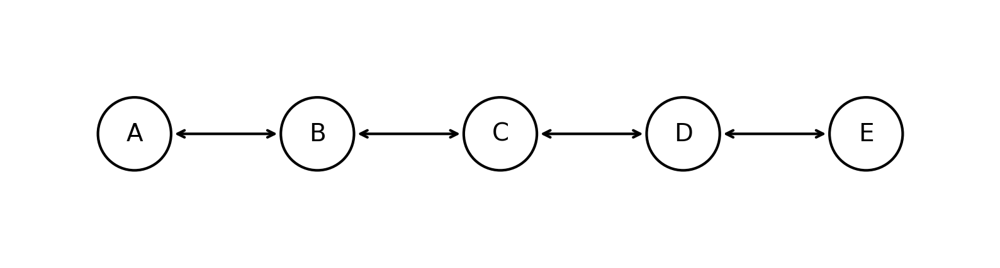
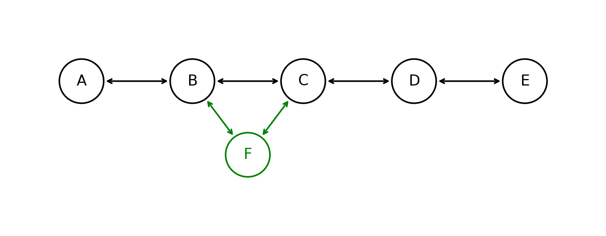
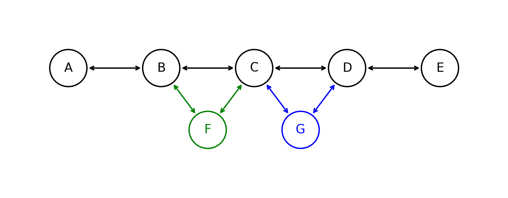
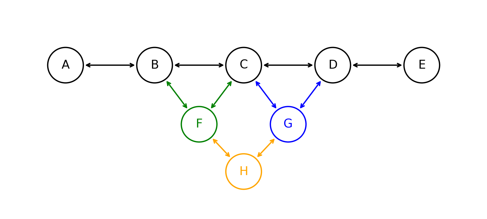
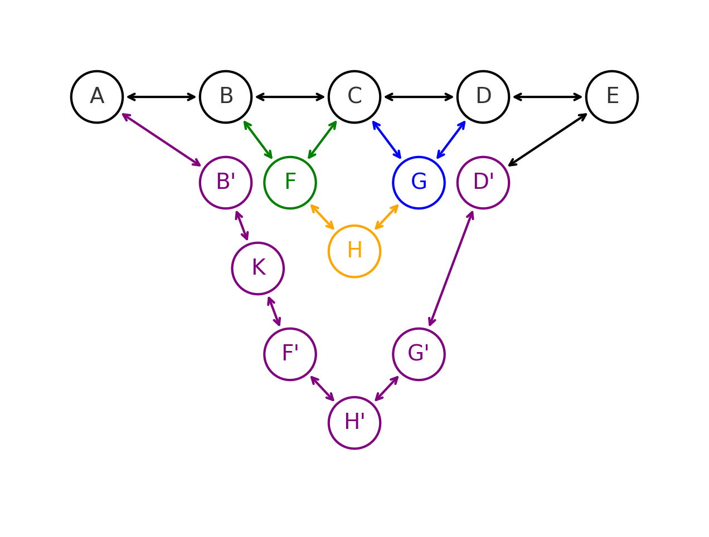

В этом разделе мы научимся делать список частично персистентным за $O(1)$. Определим типы запросов, которые мы сможем поддерживать:

* `AddAfter(u, x)` - вставить новую вершину `x` после вершины `u`
* `Delete(u)` - удалить вершину `u`
* `Next/Prev(u_k)` - получить следующую/предыдущую вершину в списке от вершины `u` (зная, что она версии `k`)
* Конечно в каждой вершине можно хранить дополнительную информацию, но нас это не интересует.

Для простоты мы разберем только запрос добавления, а удаление будет аналогично.

### Проблема

Предположим, что мы захотим воспользоваться методом _fat node_, аналогично персистентному массиву. Тогда в каждой вершине нам нужно будет хранить список указателей на все следующие и предыдущие вершины всех версий.

```cpp
struct Neighbor {
    int version;
    Node *ptr;
}

struct Node {
    vector<Neighbor> next;
    vector<Neighbor> prev;
    // maybe some additional information and its versions
    // ...
}
```

Такой подход сделает структру персистентной, но запрос `Next/Prev` будет работать за $O(\log n)$ из-за бинпоиска нужной версии.

### Решение

Ограничим список из next/prev всего лишь двумя версиями.

```cpp
struct Node {
    optional<Neighbor> next[2];
    optional<Neighbor> prev[2];
}
```

Главный вопрос - что делать, если на шаге $k$ у нас уже есть две заполненные версии `next` у вершины $u$, и мы хотим добавить новую вершину $v$ после $u$? В таком случае мы будем применять технику _copy path_:

* Если $u$ уже имеет две версии `next`, то мы создаем новую вершину $u'$, соединяя ее с $prev(u)$ и $v$.
* Если $prev(u)$ тоже имел две версии `next`, то придется проделать такую же процедуру копирования, пока не дойдем до вершины, у которой есть свободная версия `next`.
* Аналогично делаем и для вершины $next(u)$, предком которой теперь будет $v$.

Рассмотрим на примере: пусть есть список из 5 вершин версии $V_0$ (черный):



Теперь персистентно добавим вершину $F$ между $B$ и $C$, поскольку у каждой из них занят только один next/prev, то мы лишь добавим указатели на $F$ в $B$ и $C$:



Теперь добавим вершину $G$ между $C$ и $D$. Опять же у $C$ и $D$ только по одному `next`, поэтому мы просто добавим указатели на $G$ в $C$ и $D$:



Теперь добавим вершину $H$ между $F$ и $G$. У каждой из них опять же есть один свободный next/prev, поэтому мы просто добавим указатели на $H$ в $F$ и $G$:



Наконец, добавим вершину $K$ между $B$ и $F$, тогда у $B$ и $F$ уже есть по два занятых `next/prev`, поэтому нам придется создать новую вершину $B'$, аналогично будет для почти всех вершин за исключением $A$ и $E$ (у них по одному занятому `next/prev`):



### Анализ времени работы

Утверждается, что такая структура будет работать за $O(1)$ в среднем. Для доказательства воспользуемся банковским методом:

* В каждой вершине при переходе из $1$ занятого `next` в $2$ занятых `next` мы добавляем $1$ монетку в вершину. В таком случае в алгоритме не происходит копирований, поскольку у вершины хватает свободной версии `next`.
* Если мы копируем вершину, то мы платим $1$ монетку из вершины, которую ранее мы гарантированно имели, поскольку она обязана была перейти из $1$ занятого `next` в $2$ занятых `next`. А больше вершину копировать из-за переполнения `next` не придется.
* Аналогично для `prev`.

Таким образом баланс всегда неотрицательный и на каждом шаге мы добавляли не больше $2$ монетки в вершину, а значит мы можем гарантировать $O(1)$ в среднем.
