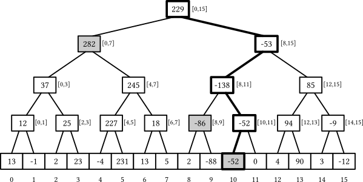
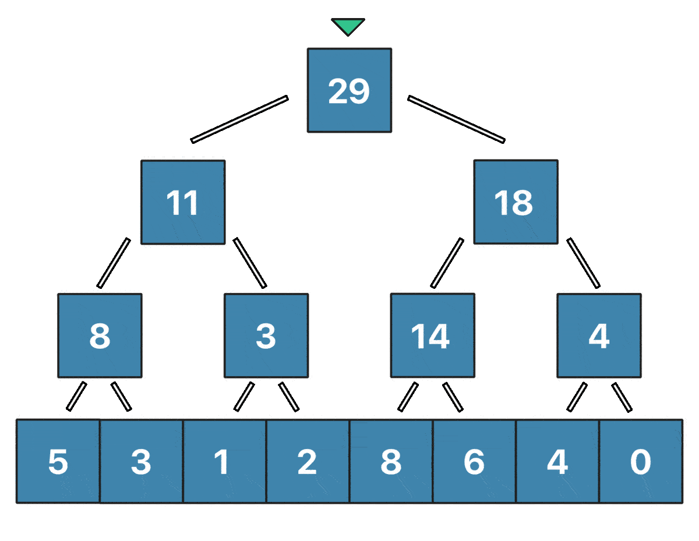
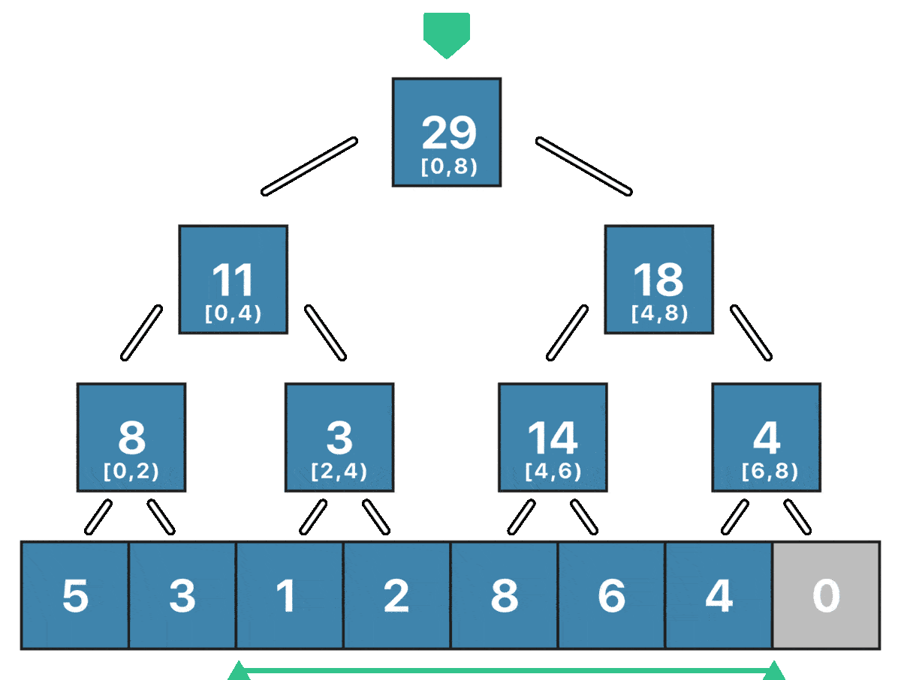
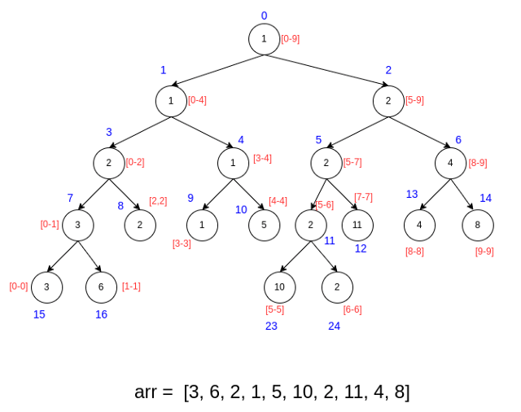

**Замечание** мы везде будем использовать полуинтервалы $[l; r)$, поскольку обычно это избавляет от проблем с индексацией (не надо думать о $\pm 1$).

## Префиксные суммы

> Дан массив $a$ длины $n$. Нужно уметь отвечать на запросы суммы на отрезке - иначе говоря вычислять $a_l + a_{l + 1} + \ldots + a_r$ за $O(1)$ на запрос.

Для того, чтобы эффективно вычислять сумму на отрезке, мы можем использовать префиксные суммы. Префиксная сумма - это массив, в котором $i$-й элемент равен сумме первых $i$ элементов массива $a$. То есть:

$$ p_i = a_0 + a_1 + \ldots + a_{i - 1} $$

Тогда сумма на отрезке $[l; r)$ будет равна:

$$ sum(l, r) = p_r - p_l $$

Таким образом, мы построили простейшую структуру данных - один массив - за $O(n)$ времени предпросчета, заняли $O(n)$ дополнительной памяти и умеем отвечать на запросы за $O(1)$ времени.

**Упражнение**: научитесь находить прозведение на отрезке (не забудьте, что бывают нули!).

### А что если мы захотим обновить массив?

Eсли мы захотим обновить элемент массива (иначе говоря добавить новый тип запроса - изменить элемент), то нам придется обновить все префиксные суммы, что займет $O(n)$ времени. Поэтому префиксные суммы не подходят для задач, где нужно обновлять массив.

## Дерево отрезков

Дерево отрезков позволит нам обрабатывать запросы суммы на отрезке и обновления массива, но за это будет плата - $O(\log n)$ времени на запрос. И более того, как мы с вами поймем дальше, дерево отрезков позволит решить множество абсолютно разнообразных задач, которые с ходу могут показаться совершенно не связанными друг с другом!

Пусть массив $a = [13, -1, 2, 23, -4, 231, 13, 5, 2, -88, -52, 0, 4, 90, 3, -12]$ Дерево отрезков над массивом $a$ - это "рекурсивная" структура и выглядит следующим образом:

{::width="70%"}

Каждая вершина дерева отрезков хранит некоторую информацию о массиве, а именно - сумму элементов массива на отрезке, который он описывает. Помимо этой информации каждая вершина хранит не больше двух детей - левого и правого. Левый ребенок описывает левую половину отрезка, а правый - правую. Таким образом, если мы знаем, что корень дерева описывает отрезок $[0; n)$, то его левый ребенок будет описывать отрезок $[0; n / 2)$, а правый - $[n / 2; n)$. И так далее.

> Сколько уровней в дереве отрезков? А сколько памяти оно занимает?

Прежде чем переходить дальше, рекомендую подумать над этими вопросами масостоятельно.

<details markdown="1">
<summary>Короткий ответ</summary>
В дереве отрезков $O(\log n)$ уровней, а память, которую оно занимает - $O(n)$.
</details>

Рассмотрим, как подобная, казалось бы, сложная структура поможет нам решить исходную задачу.

### Построение дерева отрезков

Мы будем строить дерево отрезков рекурсивно. Если мы хотим построить дерево отрезков над массивом $a[l; r)$, то мы можем сделать это следующим образом:

1. Если $r - l == 1$, то мы находимся в листе дерева отрезков. В этом случае мы просто создаем вершину, которая хранит значение $a[l]$ и возвращаем ее.
2. Если $r - l > 1$, то мы находимся в внутренней вершине дерева отрезков. В этом случае мы можем разбить отрезок $[l; r)$ на два отрезка $[l; m)$ и $[m; r)$, где $m = (l + r) / 2$. Затем мы рекурсивно строим левое и правое поддеревья и создаем вершину, которая хранит сумму значений левого и правого поддерева.

Тогда реализация построения дерева отрезков будет очень простой:

```cpp
int a[N]; // исходный массив
int t[2 * N]; // массив, в котором мы будем хранить дерево отрезков

int build(int v, int l, int r) { // в какой вершине находимся и за какой подобрезок она отвечает
    if (r - l == 1) { // если мы находимся в листе
        return t[v] = a[l]; // то просто записываем значение
    } else {
        int m = (l + r) / 2; // находим середину
        return t[v] = build(left(v), l, m) + build(right(v), m, r); // рекурсивно строим левое и правое поддеревья
    }
}

build(0, 0, n); // строим дерево отрезков над массивом a
```

О том, что такое `left(v)` и `right(v)` мы поговорим чуть позже.

### Запрос обновления

Заметим, что лишь логарифм вершин дерева отрезков содержит информацию о значении $i$-го элемента массива. То есть нам нужно обновить в точности $\log n$ вершин при изменении одного элемента массива, и это крайне легко делать снизу вверх - сначала обновить лист, содержащий сумму только одного элемента ($a_{pos}$), затем его родителя, затем родителя родителя и так далее. Визуализировать обновление $a_2 = 7$ для массива $[5, 3, 1, 2, 8, 6, 4, 0]$ можно так:

{:width="70%"}

Реализация:

```cpp
void update(int v, int l, int r, int pos, int x) // обновляем элемент pos на x; v - текущая вершина, в которой находимся, [l; r) - отрезок, который она описывает
{
    if (r - l == 1) { // если мы находимся в листе
        return t[v] = x; // то просто записываем значение
    } else {
        int m = (l + r) / 2; // находим середину
        if (pos < m) { // если pos находится в левой половине
            update(left(v), l, m, pos, x); // обновляем левое поддерево
        } else { // иначе pos находится в правой половине
            update(right(v), m, r, pos, x); // обновляем правое поддерево
        }
        t[v] = t[left(v)] + t[right(v)]; // обновляем значение в текущей вершине
    }
}
```

### Запрос суммы

Остался самый "сложный" запрос - запрос суммы на отрезке $[ql; qr)$. О вычислении суммы на таком отрезке можно думать как об оптимизированном обходе всего дерева отрезков. Оптимизирован он будет потому, что мы не будем посещать заведомо "бесполезные" вершины. Рассмотим произвольную вершину $v$ ДО, которая отвечает за отрезок $[l; r)$ и отрезок $[ql; qr)$, сумму на котором мы хотим найти. Мы можем рассмотреть три случая:

1. Если отрезок $[l; r)$ не пересекается с отрезком $[ql; qr)$, то мы возвращаем 0 - такая вершина не вносит вклад в сумму, как и все её дети.
2. Если отрезок $[ql; qr)$ полностью содержит отрезок $[l; r)$, то мы возвращаем сумму на отрезке $[l; r)$ - такая вершина полностью входит в искомый отрезок, как и все её дети.
3. Если отрезок $[ql; qr)$ как-то иначе пересекает отрезок $[l; r)$, то мы рекурсивно ищем сумму в левом и правом поддеревьях.

Пример запроса суммы на отрезке $[2; 6)$ для массива $[5, 3, 1, 2, 8, 6, 4, 0]$:

{:width="70%"}

```cpp
int sum(int v, int l, int r, int ql, int qr) { // надо найти сумму на отрезке [ql; qr), находимся в вершине v, которая отвечает за отрезок [l; r)
    if (ql >= r || qr <= l) { // если отрезок [ql; qr) не пересекается с отрезком [l; r), то возвращаем 0
        return 0;
    } else if (ql <= l && qr >= r) { // если отрезок [ql; qr) полностью содержит отрезок [l; r), то возвращаем сумму
        return t[v];
    } else { // иначе отрезок [ql; qr) пересекает отрезок [l; r), то рекурсивно ищем сумму в левом и правом поддеревьях
        int m = (l + r) / 2;
        return sum(left(v), l, m, ql, qr) + sum(right(v), m, r, ql, qr);
    }
}
```

Почему же такая оптимизация гарантирует $O(\log n)$ на запрос? Оказывается, это следует из двух фактов:

1. Глубина дерева отрезков $O(\log n)$.
2. Рекурсивный обход дерева отрезов будет посещать на каждом уровне не более $4$ вершин

<details markdown="1">
<summary>Доказательство</summary>
Первый факт не требует доказательств.

Второй факт требует лишь небольшого индукционного наблюдения по глубине дерева. Мы его немного уточним: на каждой глубине $h$ мы посетим не больше 4 вершин, при чем не менее двух из них "остановят" рекурсию (потому что они либо целиком содержатся в отрезке, либо целиком не пересекаются с отрезком - одна из двух наших оптимизаций).

База индукции - корень - 1 вершина, поэтому утверждение верно. Переход индукции: по предположению индукции на глубине $h$ у нас осталось не более 2 вершин, которые рукурсивно разобьются на $4$ вершины - сгруппируем такие вершина на две пары - порожденные левой и правой вершиной с глубины $h$. Но правая пара - будет удволетворять утверждею о том, что либо левая вершина целиком находяится в $[ql; qr]$, либо правая вершина целиком не пересекается с $[ql; qr]$ (нарисуйте, чтобы проверить), аналогично с левой парой вершин. Так мы доказали переход индукции.
</details>

### Что такое left(v) и right(v)?

Вместо того, чтобы как-то явно хранить левого и правого ребенка в динамической памяти (что замедлит работу программы), мы будем хранить все вершины дерева отрезков в одном массиве. Однако наша задача будет понять: как имея номер вершины $v$ в массиве, найти номера ее детей. Для этого посмотриите внимательно на то, как будет устроена нумерация вершин, если их естественным образом пронумеровать сверху вниз и слева направо (синим цветом - номер вершины):

{::width="70%"}

Легко заметить, что левый ребенок вершины $v$ будет находиться в позиции $2 * v + 1$, а правый - в позиции $2 * v + 2$. Таким образом, мы можем легко вычислить номера детей вершины $v$.

В С++ из языка С пришли макросы - это простейшие шаблоны, которые тоже разворачиваются на этапе компиляции:

```cpp
#define left(v) (2 * (v) + 1)
#define right(v) (2 * (v) + 2)
```

Однако макросы разворачиваются "совсем глупо" - просто полностью копируя аргумент как текст (без вычисления выражения). Поэтому порядок арифметических действий в может быть нарушен - поэтому всё максимально обернуто в скобки. Простой пример, в котором порядок действий был сломался без скобок следующий:

```cpp
#define bad_left(v) (2 * v + 1)

bad_left(1 + 2) // 2 * 1 + 2 + 1 = 5
// хотя вы бы ожидали 2 * (1 + 2) + 1 = 7
```

**Упражнение**: придумайте аргумент, при котором отсутсвие вншесних скобокn тоже приведет к ошибке.

### Какие операции вообще можно поддерживать?

На самом деле дерево отрезков прекрасно справляется с операциями, которые можно "склеивать": если мы знаем $f(l, m)$ и $f(m, r)$, то мы можем вычислить $f(l, r)$ за $O(немного)$ времени. К таким операциям относятся сумма, минимум, НОД и множество других операций. А вот, например, операция "количество различных чисел на отрезке" не является такой операцией.

### Список задач

1. Необходимо научиться отвечать на два типа запросов: add $l$ $r$ $x$ - добавить на отрезке $[l; r)$ число $x$ и get $pos$ - узнать значение на позиции $pos$.
2. Необходимо научиться проверять, является ли подстрока $s_{l\ldots r}$ правильной скобочной за $O(\log n)$, строка состоит только из одного вида скобок - ().
3. Hа кольцевой парковке есть $n$ мест пронумерованых от $1$ до $n$. Есть два вида событий прибытие машину на парковку и отъезд машины с парковки. Если машина приезжает на парковку, а её место занято, то она едет далее по кругу и встаёт на первое свободное место.
4. Необходимо научиться искать $k$-ю порядковую статистику на отрезке за:
    1. $O(\log^3 n)$
    2. $O(\log^2 n)$
    3. $^{(*)}$ $O(\log n)$
5. $^{(**)}$ Необходимо научиться находить количество различных чисел на отрезке за $O(\log n)$.
