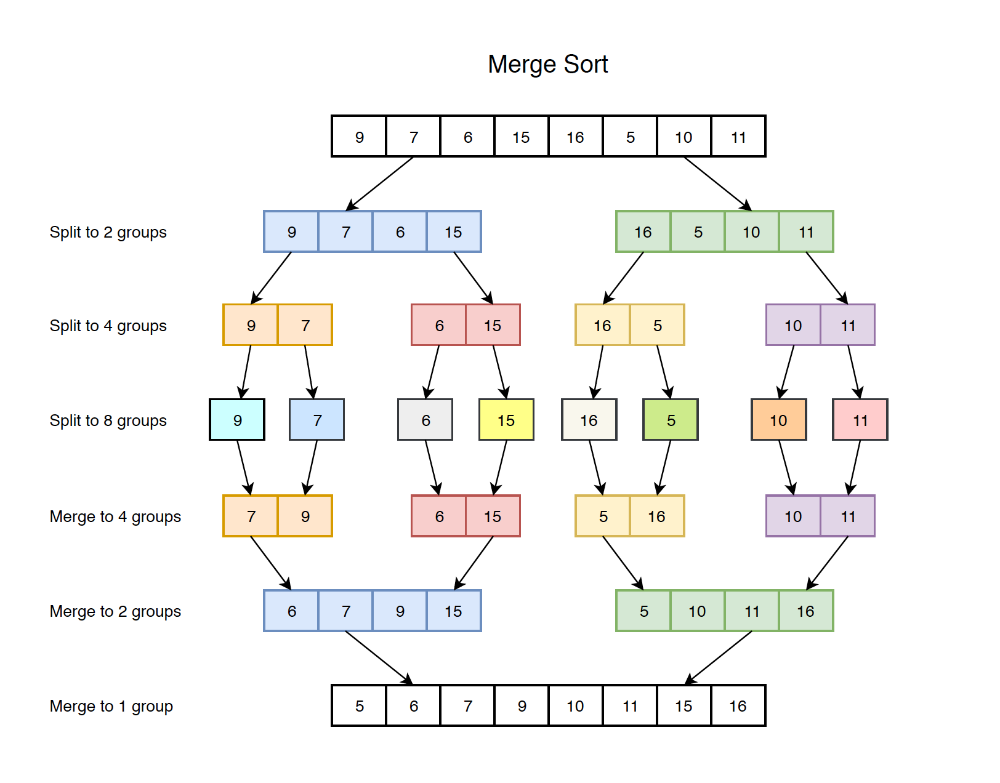

В отличии от квадратичных сортировок, сортировка слиянием (англ. _merge sort_) созволяет сортировать массив за время $O(n \log n)$. Главное в этой сортировке - её простота в понимании и реализции.

## Merge

Для начала разберем простой вспомогательный алгоритм, который назовём `merge`. Он принимает два ОТСОРТИРОВАННЫХ массива и выдает отсортированный массив, состоящий из элементов обоих массивов.  Работу функции лучше всего описать гифкой:


Как вы видите, если обозначить за $n$ размер первого массива, а за $m$ размер второго массива, то алгоритм работает за $O(n + m)$.

Прокомментирую, как работает данный алгоритм:

* Поддерживаем два указателя на текущий элемент в каждом массиве - $i$ и $j$.
* Сравниваем два текущих элемента и выписываем в ответ меньший из них
* Сдвигаем соответствующий указатель

```cpp
vector<int> merge(const vector<int>& a, const vector<int>& b) {
    int n = a.size(), m = b.size();
    vector<int> res(n + m);
    for (int i = 0, j = 0; i < n && j < m; ) {
        if (i < n && j < m && a[i] < b[j] || j == m) {
            res[i + j] = a[i];
            ++i;
        } else {
            res[i + j] = b[j];
            ++j;
        }
    }
    return c;
}
```

В стандартной библиотеке уже есть функция [merge](https://en.cppreference.com/w/cpp/algorithm/merge), которая делает то же самое. Принимает на вход начало и конец каждого из массивов и место, куда записать результат.

## Merge sort

Теперь воспользуемся техникой "Разделяй и властвуй" (англ. _Divide and Conqueror_). Что же мы будем разделять и как нам над этим властвовать?

* **Divide**. Разделим массив на две равные части. Отсортируем каждую из частей по-отдельности рекурсивно
* **Conqueror**. Теперь, когда каждая из частей массива отсортированная, мы можем их склеить с помощью функции `merge`.


Напишем код и воспользуемся встроенной функцией `merge` и `copy`:

```cpp
void sort(vector<int>& a, int l, int r) { // сортируем интервал [l; r)
    if (r - l == 1) {
        return; // массив из одного элемента отсортирован
    } else {
        int m = (r + l) / 2;
        sort(a, l, m);
        sort(a, m, r);
        vector<int> res(r - l);
        merge(a.begin() + l, a.begin() + m, a.begin() + m, a.begin() + r, res.begin());
        copy(res.begin(), res.end(), a.begin() + l);
    }
}
```

<div markdown="1" class="tip">
**Обратите внимание!** Вы не можете класть результат сразу в a.begin() + l. В этом случае вы можете затереть значения левого массива! Поэтому я создаю временный массив и только потом из него копирую элементы в исходный.
</div>

## Время работы

{:width="70%"}

Картинка сверху наглядно демонстрирует, что суммарное время работы - $O(n \log n)$. Почему? Потому что всего у нас есть $\log n$ уровней, на каждом из которых мы делаем $O(n)$ операций суммарно в процессе `merge`. Таким образом, суммарное время работы - $O(n \log n)$.

## Упражнения

> Инверсией в массиве называется пара (i, j), для которой верно, что $i < j$ и $a_i > a_j$. Посчитайте количество инверсий за время $O(n \log n)$.
