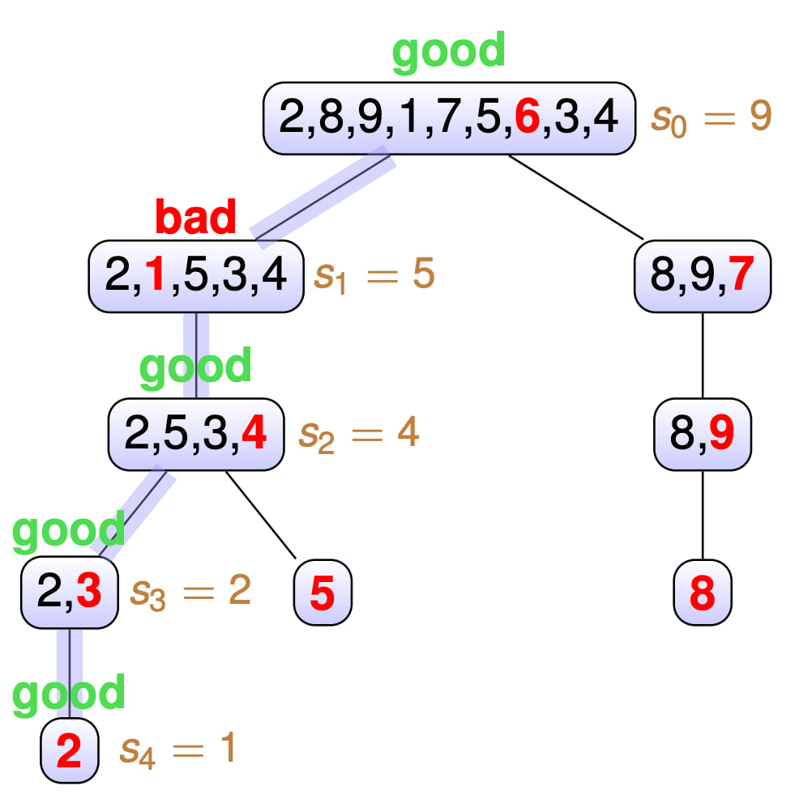

Быстрая сортировка (англ. _quick sort_) - это другая сортировка за время $O(n \log n)$. С одной стороны она похожа на сортировку слиянием - мы тоже будем использовать метод "Разделяй и властвуй", но с другой стороны, она недетерминированная, то есть в ней присутствует элемент случайности. И хотя это может показаться минусом, на практике обычно используется именно она, поскольку в среднем у нее лучше константа, а так же она нуждается всего в $O(\log n)$ дополнительной памяти в отличии от Merge Sort.

## Partition

Прежде чем переходить к сортировке, мы придумаем некоторый вспомогательный алгоритм, который назовем `partition`. Он будет принимать массив и опорный элемент (pivot) и возвращать массив, в котором все элементы, меньшие pivot, стоят левее него, а большие - правее, а равные сгруппированы между. Таким образом мы частично отсортируем массив относительно pivot.

<div markdown="1" class="alert alert-error">

**Важное замечение**: часто реализации `partition` из интернета не работают для случаев, когда в массиве есть равные элементы. Поэтому я сразу введу `partition` для случая, когда равные элементы сгруппированы вместе.
</div>

### Простой случай

Начнем со случая, когда в массиве нет равных элементов, а `pivot` - это последний элемент массива. Тогда `partition` будет выглядеть так:


Алгоритм поддерживает два указателя, которые будут двигаться от начала массива к концу. Первый указатель $i$ будет указывать на первый элемент, который больше `pivot`, а второй указатель $j$ будет указывать на первый элемент, который меньше `pivot`. Когда они найдутся, мы их поменяем местами. Таким образом, мы будем двигать указатели, пока $i < j$. Когда они встретятся, мы поменяем `pivot` с элементом на позиции $i + 1$.

```cpp
void BadPartition(int l, int r, int *a) {
    // сортируем a[l..r]
    int x = a[r]; // pivot
    int i = l - 1;
    for (int j = l; j < r; j++) {
        if (a[j] < x) {
            i++;
            swap(a[i], a[j]);
        }
    }
    swap(a[i + 1], a[r]);
}
```

### Реальный `partition`

Реальный `partition` будет отличаться лишь тем, что `pivot` может стоять в произвольном месте массива, а так же мы будем поддерживать дополнительные два указателя на границы равных элементов ($i$ и $j$).

```cpp
void Partition(int l, int r, int x, int *a, int &i, int &j) {
    // сортируем a[l..r]
    // i, j - это границы равных элементов (из x)
    i = l, j = r;
    while (i <= j) {
        while (a[i] < x) i++;
        while (a[j] > x) j--;
        if (i <= j) swap(a[i++], a[j--]);
    }
}
```

## Быстрая сортировка

Быстрая сортировка (англ. _Quick sort_) очень похожа на merge sort, но в ней есть одно ключевое отличие: она недетерминированная, то есть в ней присутствует элемент случайности.

Сортировка будет состоять из нескольких итераций:

1. Выбор опорного элемента (pivot) - он производится случайно.
1. Вызываем функцию partition, которая сортирует всё относительно опорного элемента. То есть все элементы, меньшие pivot, оказываются левее него, а большие - правее.
1. Рекурсивно запускаем сортировку для левой и правой частей массива.

Добавим сюда визуализацию:


Если хотите посмотреть, как работает быстрая сортировка на примере танца, то [Quick-sort with Hungarian](https://youtu.be/ywWBy6J5gz8) вам поможет.

## Время работы

<div markdown="1" class="alert alert-theorem">
**Теорема о времени работы быстрой сортировки**

1. Быстрая сортировка работает за $O(n \log n)$ в среднем.
2. Вероятность того, что глубина рекурсии будет больше $C \cdot \log n$ для некоторой константы $C$ не превосходит $O\left(\frac{1}{n}\right)$.

</div>

Первая часть теоремы говорит о том, что в среднем быстрая сортировка работает быстро, а вторая часть говорит о том, что вероятность того, что она будет работать медленно, крайне мала.

Будем доказывать теорему для случая, когда все элементы различны в предположении, что можно сделать линейную пред/пост обработку, чтобы все элементы были различны. Это можно сделать, например, методами хеширования или просто более аккуратной оценкой для случая равных элементов, но это технические детали, которые мы опустим.

Итак, докажем первую часть теоремы о среднем времени работы быстрой сортировки.

<details markdown="1">
<summary>Доказательство индукцией (для школьников)</summary>

Начнем с некоторой вспомогательной леммы:

**Лемма:** $\sum\limits_{i=1}^{n - 1}k \log k \leq \frac{n^2}{2} \log n - \frac{n^2}{4}$.

<details markdown="1">
<summary>Доказательство леммы</summary>

Прибавим и вычтем $\sum\limits_{k=1}^{n - 1}k \log n = \frac{n(n - 1)}{2}\log n$ к $\sum\limits_{i=1}^{n - 1}k \log k$:

$\sum\limits_{i=1}^{n - 1}k = \frac{n(n - 1)}{2}\log n + \sum\limits_{k=1}^{n - 1}(k \log k - k \log n)$

Первое слагаемое оценим сверху как $\frac{n^2}{2} \log n$. Второе слагаемое оцениваем чуть сложнее:

$\sum\limits_{k=1}^{n - 1}(k \log k - k \log n) = \sum\limits_{k=1}^{n - 1}k (\log k - \log n) = \sum\limits_{k=1}^{n - 1}k \log \frac{k}{n} = -\sum\limits_{k=1}^{n - 1}k \log \frac{n}{k}$

Оставим от суммы только вторую половину слагаемых, то есть ту, у которых $k \geq \frac{n}{2}$, следовательно их логарим хотя бы $1$. Тогда:

$\sum\limits_{k=1}^{n - 1}k \log \frac{k}{n} \geq \sum\limits_{k=\frac{n}{2}}^{n - 1}k \log \frac{n}{k} \geq \sum\limits_{k=\frac{n}{2}}^{n - 1}k \cdot 1$

Последнюю сумму мы отдельно посчитаем как сумму африметичекой прогрессии:

$\sum\limits_{k=\frac{n}{2}}^{n - 1}k = \frac{3n^2 - 2n}{8} \geq \frac{2n^2}{8}$

Последнее неравенство верно из $3n^2 - 2n \geq 2n^2$ при $n \geq 2$. Это крайне грубая оценка и по факту можно сильно лучше (это улучшит $C$), но нас устроит и такая. Наконец, просуммировав оценки:

$\sum\limits_{i=1}^{n - 1}k \log k \leq \frac{n^2}{2} \log n - \frac{n^2}{4}$.
</details>

Вернемся к основному утверждению и докажем его по индукции. А именно время работы алгоритма сортировки $T(n) <= C n \log n$, где $C = 2$.

**База индукции:** $n = 1$. В этом случае алгоритм работает за 0 операций. При $n=2$ алгоритм сделает 1 операцию.

**Предположение индукции:** пусть для всех $k < n$ время работы алгоритма $T(k) \leq C \cdot k \log k$.

**Шаг индукции:** пусть $n$ - размер массива.

Так как мы выбираем случайный элемент в качестве опорного, то вероятность того, что он окажется $i$-м в отсортированном массиве (что равносильно быть на $i$-й позиции после функции `partition`) равна $\frac{1}{n}$. В каждом из этих случаев мы выполним $n$ операций сравнения в функции `partition` и рекурсивно запустимся для двух подзадач размера $i$ и $n - i - 1$. Тогда среднее время работы алгоритма можно записать как:

$T(n) = n + \frac{1}{n} \sum\limits_{k=0}^{n-1} (T(k) + T(n-k-1)) = n + \frac{2}{n}\sum\limits_{k=0}^{n-1} T(k)$

Применяя предположение индукции, и $T(0) = 0$, распишем сумму:

$T(n) = n + \frac{2}{n}\sum\limits_{k=0}^{n-1} T(k) = \frac{2C}{n} \sum\limits_{k=1}^{n - 1} k \log k$

Теперь применим лемму:

$T(n) = n + \frac{2C}{n} \sum\limits_{k=1}^{n - 1} k \log k \leq n + \frac{2C}{n} \left( \frac{n^2}{2} \log n - \frac{n^2}{4}\right)$

Расскроем скобки и упростим:

$T(n) \leq C n \log n + (1 - \frac{C}{2})n$

При $C \geq 2$ второе слагаемое не превосходит нуля, следовательно $T(n) \leq C n \log n$ что и требовалось доказать.

</details>

<details markdown="1">
<summary>Доказательство матожиданием (для студентов)</summary>
Под временем работы сортировки мы будем подразумевать количество операций сравнения элементов массива. Пусть $X$ - случайная величина, равная количеству операций сравнения элементов массива в процессе сортировки. Тогда среднее время работы сортировки $T(n) = E[X]$.

Заметим, что в процессе сортировки никакая пара элементов не будет сравниваться дважды, поскольку сравнения происходят только с опорным элементов $pivot$ в функции `partition`, после чего данный элемент больше не участвует в сортировке (поскольку встал на нужную позицию).

Пусть $X_{ij}$ - случайная величина равная количеству операций сравнения между $a_i$ и $a_j$. Тогда:

$\mathbb{E}[X] = \mathbb{E}\left[\sum\limits_{i=1}^{n-1} \sum\limits_{j=i+1}^{n} X_{ij}\right] = \sum\limits_{i=1}^{n-1} \sum\limits_{j=i+1}^{n} \mathbb{E}\left[X_{ij}\right] = \sum\limits_{i=1}^{n-1} \sum\limits_{j=i+1}^{n} \text{Pr}[a_i\text{ сравнивался с }a_j]$

Оценим вероятность того, что два элемента сравнивались. Как уже было сказано раньше, это возможно только в случае, когда один из них - это $pivot$. Следовательно, вероятность того, что $a_i$ сравнивался с $a_j$ равна вероятности того, что один из них был выбран в качестве $pivot$, что равно $\frac{2}{r - l + 1}$, где $r$ и $l$ - индексы границ массива, который мы сортируем. Поскольку сумму по всем подотрезкам мы можем брать в любом порядке, то возьмем сначала в порядке возрастания левой границы $L$ (от $1$ до $N$), а потом в порядке возрастания длины $K$ (от $1$ до $N-L-K+1$, чтобы не выйти за границы массива):

$\mathbb{E}[X] = \sum\limits_{L=1}^{N} \sum\limits_{K=1}^{N-K-L} \frac{2}{K} < \sum\limits_{L=1}^{N} \sum\limits_{K=1}^{N} \frac{2}{K} = N \cdot \sum\limits_{K=1}^{N} \frac{2}{K}$

Воспользуемся суммой гаормонческого ряда и получим:

$\mathbb{E}[X] = 2 N \ln N + O(N)$

То есть мы доказали, что среднее время работы быстрой сортировки равно $O(N \log N)$.
</details>

На самом деле каждое из доказательств не просто предоставило оценку в среднеем, а даже нашло константу перед $n \log n$. По этой константе quick sort превосходит многие сортировки, именно поэтому он так часто используется на практике.

К сожалению, доказательство второй части теоремы будет понятно только студентов, которые хорошо помнят основы дискретной математики.

<details markdown="1">
<summary>Доказательство второй части теоремы</summary>

Для начала вспомним пару замечааельных утверждений из мира оценок вероятностей:

<div markdown="1" class="alert alert-lemma">

**Неравенство Чернова**

Пусть $X_i \sim Bern(p_i)$, а $X = \sum\limits_{i=1}^{n}X_i$. Тогда для любого $r > 0$ верно:

$$ \text{Pr}\left[X \geq \mathbb{E}\left[X\right] + r\right] < \exp\left(-\frac{r^2}{n}\right) $$

</div>

<div markdown="1" class="alert alert-warning">

**Relaxed independence assumption**

Неравенство Чернова будет работать даже, если мы ослабим условие независимости на $X_i$. А именно, пусть для любых $1 \leq i \leq n$ и $x_1, \ldots, x_{i-1} \in \{0, 1\}$ верно, что

$$\text{Pr}[X_i = 1 \mid X_1 = x_1, X_2 = x_2, \ldots, X_{i-1} = x_{i-1}] \leq p_i$$

Тогда неравенство Чернова будет продолжать работать.

</div>

**Замечание:** Мы оцениваем время работы алгоритма, как количество сравнений. Рассмотрм произвольный элемент $a_i$ массива. Пусть в дереве рекурсии элемент встречается в последний раз на глубине $H_i$. Это будет означать, что $a_i$ был выбран в качестве опорного элемента на глубине $H_i$ и после этого не участвовал в сравнениях, а до глубина $H_i$ сравнивался на каждом из уровней дерева с `pivot`. Это значит, что $a_i$ участвовал в точности $H_i$ сравнениях. Таким образом, суммарное время работы алгоритма можно оценить как $\sum\limits_{i=1}^{n} H_i$. Но мы же интересуемся вероятностью того, что глубина дерева будет больше $C \log n$. Поэтому наша задача оценить вероятность того, что $H_i > C \log n$.

Итак, докажем, что

$$ Pr[\max\limits_{i=1}^{n} H_i \geq C \log n] \leq \frac{1}{n} $$

Зафиксируем $a_k$ - произвольный элемент, за глубиной рекурсии которого мы будем следить.

* Разобьем все вершины дерева рекурсии на два класса - "хорошие" и "плохие". Вершина $v$ будет хорошей, если `pivot` попал в интервал от $33\%$ до $66\%$ массива. Иначе назовем вершину плохой. Иначе говоря, если после `partition` размеры подзадач отличаются не более чем в $3$ раза, то вершина хорошая, иначе плохая.



* За $s_i$ мы обозначим размер подзадачи на глубине $i$ в дереве рекрсии, за $P$ - пусть от корня дерева до листа $v$, содаржащего только $a_k$. То есть $H_k = depth(v)$.

* Заметим, что на пути от корня до $v$ не более $3 \log n$ хороших вершин, потому что хорошие вершины уменьшают размер подзадачи как минимум в $\frac{2}{3}$ раза.

* Предположим $H_k \geq 24 \log n$. Тогда на пути $P$ от корня до $v$ будет не менее $21 \log n$ плохих вершин. Оценим вероятность такого исхода:
  * Введем случайные величины $X_i$ - равные $1$, если вершина $i$-го уровня на пути $P$ плохая, иначе $0$. А $X$ - есть сумма всех $X_i$.
  * Заметим, что $\text{Pr}[X_i = 1 \mid X_0 = x_0, \ldots X_{i-1} = x_{i-1}] \leq \frac{2}{3}$. То есть выполняются условия **Relaxed independence assumption** для неравенства Чернова
  * $E[X] = \sum\limits_{i=1}^{24}X_i = \frac{2}{3} 24 \log n = 16 \log n$
  * Тогда применяем неравенство Чернова для $\text{Pr}[X > 21 \log n] = \text{Pr}[X > E[X] + 5 \log n]$, то есть $r = 5 \log n$ и получаем:
  * $ \text{Pr}[X > 21 \log n] \leq \exp\left(-2\frac{(5 \log n)^2}{24 \log n}\right) = \exp\left(-\frac{50}{24}\log n\right) \leq \frac{1}{n^2}$

Мы получили оценку $\frac{1}{n^2}$ вероятности того, что глубина конкретной вершины дерева рекурсии больше $24 \log n$. Так как всего $n$ вершин, то вероятность того, что хотя бы одна вершина дерева рекурсии имеет глубину больше $24 \log n$ равна $\frac{1}{n}$. Что и требовалось доказать.

</details>

## Ссылки

* [University of Cambirige, Random Algorithms cource](https://www.cl.cam.ac.uk/teaching/2122/RandAlgthm/lec23_concentration_handout.pdf)
