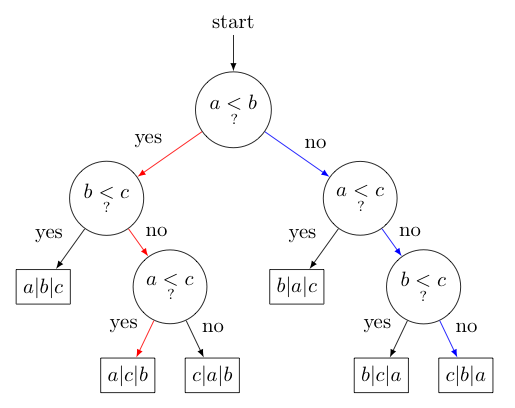

Мы уже рассмотрели несколько сортировок, которые работают за $O(n \log n)$, но что если мы хотим сортировать быстрее? Оказываеся, что при наличии некоторых естественных ограничений, можно доказать, что быстрее сортировать нельзя. То есть в этом разделе докажем нижнюю оценку на время работы сортировки.

## Естественные ограничения

Мы введём следующие ограничения:

* С элементами массива можно производить только сравнения (за $O(1)$), то есть мы не можем применять арифметические, битовые и любые другие операции над элементами массива
* Сортировка принимает на вход массив из $n$ элементов и возвращает массив индексов в отсортированном порядке (перестановку)

Любая сортировка, которая удовлетворяет этим ограничениям, называется **сортировкой сравнениями**. Все рассмотренные ранее алгоритмы сортировки являются сортировками сравнениями (bubble, merge, quick sort).

::: theorem
**Теорема о невозможности сортировки быстрее $\Omega(n \log n)$**

Любая сортировка сравнениями работает за $\Omega(n \log n)$ как в худшем случае, так и в среднем.

:::

Мы докажем только детерминированный вариант теоремы, для рандомизированных алгоритмов доказательство схоже и потребует лишь технического ввода меры над распределениями деревьев решений.

## Доказательство

### Худший случай

Докажем, что любая сортировка сравнениями работает за $\Omega(n \log n)$ в худшем случае. То есть для любого алгоритма сортировки сравнениями найдется такой входной массив, на котором время работы будет хотя бы $\Omega(n \log n)$.

Поскольку нам доступна только одна операция - операция сравнения - рассмотрим наш алгоритм как **дерево решений**. Дерево решений - это бинарное дерево, в котором каждая вершина соответствует одному сравнению, а в листьях дерева находятся перестановки элементов массива - результат работы функции.

Вот как выглядит дерево решений для сортировки массива из 3 элементов ($a$, $b$ и $c$):

Заметим, что **глубина дерева** (то есть самый длинный путь от корня до листа) - это количество сравнений, которое делает наш алгоритм в худшем случае (для определения какой-то из перестановок). Мы должны показать, что глубина дерева не меньше $\Omega(n \log n)$.

Доказальство в три шага:

**Шаг 1.** Поскольку у нас есть $n!$ перестановок, то листьев у нашего дерева будет как минимум $n!$ - без этого мы не сможем различить как минимум две перестановки и следовательно выдадим неправильный ответ на одной из них.

**Шаг 2.** Поскольку у бинарного дерева глубина не меньше логарифма числа листьев, то получаем, что глубина дерева не меньше $\log_2 n!$.

**Шаг 3.** Оценим снизу $\log_2 n!$.

Оценка для студентов Стирлингом

По Формуле Стирлинга $\ln n! = n \ln n - n + O(\ln n) = \Omega(n \log n)$. Но на самом деле вы даже доказали точкую оценку с учетом константы!

Оценка для школьников неравествами

Обозначим за $k = \lfloor \log_2 n \rfloor$.

Тогда $\log n! = \log 1 + \log 2 + \log 3 + \log 4 + \log 5 + \ldots + \log (n - 1) + \log n \geq \ldots$

Оценим сверху каждое слагаемое ближайшей меньшей степенью двойки под логарифмом:

$\ldots \geq \log 1 + \log 2 + \log 2 + \log 4 + \log 4 + \ldots = 0 + 2 \cdot \log 2 + 4 \cdot \log 4 + 8 \log 8 + \ldots + 2^{k} \log 2^{k} \geq \ldots$

Оценим сумму как последнее слагаемое:

$\ldots \geq k^2 \log 2^{k} = \Omega(n \log n)$.

В итоге мы доказали, что $\log_2 n! = \Omega(n \log n)$, следовательно глубина дерева решений не меньше $\Omega(n \log n)$, что и требовалось доказать.

### Средний случай

Докажем, что любая сортировка сравнениями работает за $\Omega(n \log n)$ в среднем.

::: lemma
**Лемма о глубине листьев двоичного дерева**

Среди всех двоичных деревьев с $n$ листьями средняя глубина листьев минизируется на дереве, у которого минимальная и максимальная глубина листа отличается не больше чем на $3$.

:::

Доказательство леммы

~~Очевидно.~~ Переподвесим нижний лист к верхнему, уменьшив суммарную глубину. Если надо, то придется создать еще один лист, чтобы сохранить их количество в процессе переподвешивания.

По лемме средняя глубина листьев минимизируется на дереве, у которого минимальная и максимальная глубина листа отличается не больше чем на константу, то есть дерево "почти сбалансировано", следовательно глубина каждого листа примерно равна, и равна примерно $\log n$ (меньше нельзя, чтобы было $n$ листьев).

Таким образом, минимальная средняя глубина листьев дерева решений с $n!$ листьями равна $\Omega(\log n!) = \Omega(n \log n)$.
