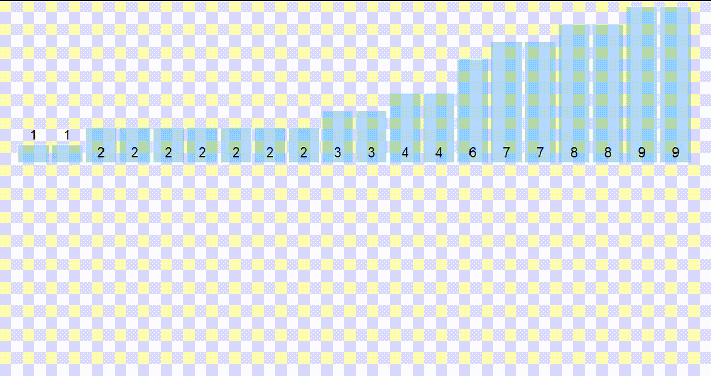
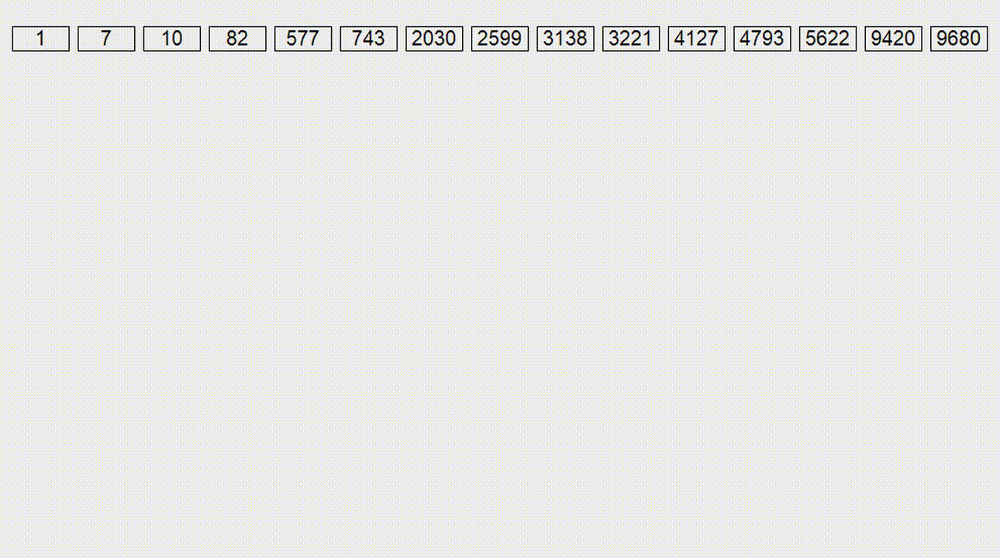

В этом разделе мы рассмотрим две сортировки, которые работают только для целых чисел. Поскольку мы знаем, что все числа в массиве целые, то у нас получится отсортировать массив быстрее чем за $O(n \log n)$ - теоретической оценки для сортировок сравнениями.

## Сортировка подсчётом

Сортировка подсчетом (англ. _counting sort_) - это одна из самых простых, но в то же время полезных сортировок. Она состоит из двух этапов:

1. Вычислим количество вхождений каждого числа в массиве
2. Выпишем элементы в порядке возрастания в соответствующем количестве



Такая сортировка работает только для целых чисел и работает быстро, если по условию максимальное число в массиве (обозначим его за $C$) не очень большое (сопоставимо с количеством элементов в массиве). В таком случае сортировка будет работать за $O(n + C)$ и требовать $O(C)$ дополнительной памяти. То есть она применима, если числа в массиве примерно до $10^6$.

```cpp
void sort(vector<int>& a) {
    vector<int> cnt(1'000'000);
    for (int x : a) {
        cnt[x]++;
    }
    int ptr = 0;
    for (int c : cnt) { // пробегаемся по всем возможным значениям
        while (c--) { // выписываем их c раз
            a[ptr++] = c;
        }
    }
}
```

## Поразрядная сортировка

Скорее всего, когда вы прочитали словосочетание "поразрядная сортирока" (англ. _radix sort_), то подумали, что мы будем сортировать числа сначала по первому разряду, затем по второму, затем по третьему и т.д. То есть это то, как вы сортируете у себя в голове. Такой подход называется MSD-сортировка (англ. _Most Significant Digit_ radix sort), и оказывается, что он не лучший по асимптотике и по удобству реализации.

Более удобный и быстрый подход называется LSD-сортировкой (англ. _Least Significant Digit_ radix sort), и, как видно по названию, мы будем сортировать числа от младшего разряда к старшему.

### Алгоритм

Для лучшей интерпретируемости алгоритма будем говорить, что на $k$-той итерации все числа состоят лишь из последних $k$ разрядов (более старшие мысленно откинем). Тогда мы хотим, чтобы к концу $k$-той итерации $k$ последних разрядов были отсортированы.

Для этого нам нужно придумать переход: пусть отсортированы $k-1$ разряд и сейчас к каждому числу дописывается ещё один разряд в начало ($k$-тый). Как отсортировать массив?

1. В отсортированном массиве сначала будут идти числа, начинающиеся на 0, затем на 1, затем на 2 и т.д. Тогда посчитаем, сколько у нас сейчас чисел, начинающихся на 0, 1, и т.д. до 9. Теперь мы знаем, начиная с какой позиции в отсортированном массиве будут идти числа, начинающиеся на 0, 1, ... 9. Назовем эти позиции "начало блока".
2. Пройдем по массиву, отсортированному по $k-1$ разряду, выписывая их в "нужный блок" - ту группу чисел, которая начинается с соответствующей первой цифры.

Почему это работает? Поскольку числа на шаге $k-1$ были отсортированы по последним разрядам и мы выписываем их ровно в том же порядке в блоки, сортировка сохранится внутри каждого из блоков. В то же время между блоками числа тоже будут отсортированы по первому разряду. Таким образом мы отсортировали числа по $k$-му разряду.



### Асимптотика

Пусть $C$ - максимальное число в массиве. Тогда такая сортировка делает $\log_{10} C$ итераций (по кажому из разрядов) и на каждой итерации два раза проходится по массиву. Итого, сортировка работает за $O(n \log_{10} C)$.

> Мешает ли нам хоть что-то поменять асимптотику с $O(n \log_{10} C)$ на $O(n \log_{1000} C)$?

Нет! В основании логарифма стоит 10 исключительно потому что нам удобно думать в 10-й системе считления. Мы можем перевести числа в 1000-ричную систему счисления и сортировать их по 3 цифрам за раз. Тогда асимптотика станет $O(n \log_{1000} C)$.

```cpp
void RadixSortBase(vector<uint32_t> &arr, uint32_t base) {
    size_t size = arr.size();
    vector<uint32_t> tmp(size);
    
    // Найти максимальное число для определения количества разрядов
    uint32_t max_val = *max_element(arr.begin(), arr.end());
    uint32_t max_digits = 0;
    if (max_val == 0) {
        max_digits = 1;
    } else {
        max_digits = static_cast<uint32_t>(floor(log(max_val) / log(base))) + 1;
    }

    vector<uint32_t> ptr(base, 0);

    uint32_t exp = 1; // Текущий разряд (base^0, base^1, ...)

    for (uint32_t digit_ind = 0; digit_ind < max_digits; ++digit_ind) {
        // Подсчитать количество элементов в каждом "ведре" (bucket)
        for (size_t i = 0; i < size; ++i) {
            uint32_t digit = (arr[i] / exp) % base;
            ++ptr[digit];
        }

        // Преобразовать счетчики в позиции с помощь частичной суммы
        exclusive_scan(ptr.begin(), ptr.end(), ptr.begin(), 0);

        // Распределить элементы во временный массив
        for (size_t i = 0; i < size; ++i) {
            uint32_t digit = (arr[i] / exp) % base;
            tmp[ptr[digit]++] = arr[i];
        }

        arr.swap(tmp); // не забыть поменять местами массивы
        exp *= base; // Перейти к следующему разряду
        fill(ptr.begin(), ptr.end(), 0); // Сбросить счетчики
    }
}

RadixSortBase(a, 100000); // Сортировка по 5-м разрядам
```

**Важно:** если вы заходите использовать такую сортировку (что маловероятно), то наиваня реализация с маленькими `base` будет медленее `std::sort`. Прочтитие следующий раздел для понимания проблем и методов их решения.

## *Мегабыстрая поразрядная сортировка

Это крайне редкий олимпиадный трюк, который позволяет эффективно сортировать массивы целых чисел. Как мы уже выяснили в прошлом разделе, поразрядная сортировка работает за $O(n \log_{B} C)$ и требует $O(n + B)$ дополнительной памяти. Это потребует от нас перевода чисел в $B$-ричную систему счисления.

### Проблема 1: арифметика

Мы будем переводить в систему счистления, являющуюся степень двойки, потому что это не требует операций деления и взятия остатка - достаточно лишь битовых операций. В частости, если $B = 2^k$, то $m$-тый разряд числа $x$ можно получить следующим образом:

```cpp
uint32_t k = 4; // B = 2^4 = 16-ричная система счистления

uint32_t x = 123456789;
uint32_t m = 3; // 3-й разряд

uint32_t B = 1 << k;
uint32_t mask = B - 1; // k единиц в двоичной записи
uint mth_digit = (x >> (k * m)) & mask;
```

Хорошо, мы избавились от операций деления и взятия остатка. Теперь мы можем взять $B=2^{16}$ и отсортировать числа всего за 2 итерации (ВАУ)! Но оказывается, что это будет не оптимально по времени работы.

### Проблема 2: кеш-промахи

Всё дело в том, что мы производим очень много Random Access доступов к массивам. У нас получится уменьшить их за счет того, что мы уменьшим $B=2^8$. Так массив $B$ будет помещаться в кеш-линию целиком и количество проходов в оперативную память уменьшится.

```cpp
void RadixSort(vector<uint32_t> &arr, size_t iteration = 4) {
    size_t size = arr.size();
    vector<uint32_t> tmp(size);

    const size_t POWER_OF_TWO = 32 / iteration;
    const uint32_t BUCKET_SIZE = 1 << POWER_OF_TWO;
    const uint32_t MASK = BUCKET_SIZE - 1;

    vector<uint32_t> ptr(BUCKET_SIZE);

    for (size_t digit = 0; digit < iteration; ++digit) {
        const size_t SHIFT = digit * POWER_OF_TWO;
        for (size_t i = 0; i < size; ++i) { // считаем количество чисел в каждом блоке
            ++ptr[(arr[i] >> SHIFT) & MASK];
        }
        exclusive_scan(ptr.begin(), ptr.end(), ptr.begin(), 0); // считаем позиции, начиная с которых будут идти блоки
        for (size_t i = 0; i < size; ++i) {
            tmp[ptr[(arr[i] >> SHIFT) & MASK]++] = arr[i]; // заполняем блоки
        }
        tmp.swap(arr);
        fill(ptr.begin(), ptr.end(), 0);
    }
}
```

### Сравнение времени работы сортировок

| Сортировка | Время работы, $n=10^6$ | Время работы, $n=10^7$ |
|------------|--------------|----------------|
| std::sort | 75 ms  | 750 ms |
| $B=10$ | 260 ms | 2500 ms |
| $B=10^3$ | 100 ms | 1000 ms |
| $B=10^4$ | 75 ms | 750 ms |
| $B=10^5$ | 55 ms | 550 ms |
| $B=2^{16}$ | **9 ms** | 250 ms |
| $B=2^{8}$ | 13 ms | **140 ms** |
| $B=2^{4}$ | 26 ms | 250 ms |

Таким образом мы можем сортировать массивы целых чисел в 5-9 раз быстрее, чем стандартная сортировка! Наивная реализация получила бы лишь 25% ускорения.
