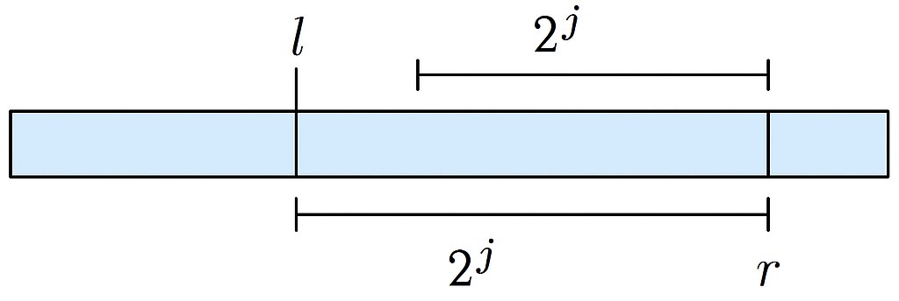

В этом разделе мы поговорим о разреженных таблицах (англ. _Sparse Table_) - неизменяемой структуре данных, которая позволяет быстро находить минимум на отрезке - за $O(1)$. Подобная задача часто встречается как полезная подзадача, а так же крайне полезна для реальных приложений, поскольку минимизирует время задержки ответа. Однако за такое время мы заплатим дважды: памятью и временем на предобработку - и то, и другое будет $O(n \log n)$.

## Постановка задачи

Дана последовательность чисел $a_1, a_2, \ldots, a_n$ и $q$ запросов вида $[l, r]$. Необходимо найти минимум на отрезке $[l, r]$.

## Sparse Table

Разреженные таблицы - это структура данных, которая по сути представляет из себя двумерный массив, $s_{k,i}$ - это минимум на отрезке $[i, i + 2^k - 1]$. То есть, мы будем хранить минимумы на отрезках длины $2^k$ для всех $k$ от $0$ до $\lfloor \log_2 n \rfloor$.

```cpp
for (int k = 0; (1 << k) <= n; ++k) {
    for (int i = 0; i + (1 << k) - 1 < n; ++i) {
        if (k == 0) {
            s[k][i] = a[i];
        } else {
            s[k][i] = min(s[k - 1][i], s[k - 1][i + (1 << (k - 1))]);
        }
    }
}
```

Как же с помощью такого массива отвечать на запросы за $O(1)$?

Для этого нам нужно заметить, что любой отрезок $[l, r]$ можно разбить на два ПЕРЕСЕКАЮЩИХСЯ отрезка длины $2^j$, где $j = \lfloor \log_2 (r - l) \rfloor$.

{{ width=50% }}

Код:

```cpp
int query(int l, int r) {
    int j = std::bit_width(r - l) - 1; // since c++20
    return min(s[j][l], s[j][r - (1 << j)]);
}
```

Стоит так же упомянуть, как можно находить степень двойки за $O(1)$ до C++20. Использование функции std::log2 из библиотеки `<cmath>` не подходит, так как она невероятно медленная и возвращает вещественное число. Вместо этого предлагается сделать предпросчет - найти необходимые степени двойки для всех возможных длин отрезка от $1$ до $n$ и записать их в массив. Для этого можно вопсользоваться фактом: $\log_2 n = 1 + \log_2 \frac{n}{2}$.

```cpp
int lg2[N + 1];

void precompute() {
    lg2[1] = 0;
    for (int i = 2; i <= N; ++i) {
        lg2[i] = lg2[i / 2] + 1;
    }
}
```

### Ограничения sparse table

* Нет обновлений - структура данных неизменяемая, то есть мы не можем эффективно обновлять массив при изменении одного элемента, поскольку в нём поменяются почти все минимумы - $O(n \log n)$. Адльернатива - дерево отрезков, которое позволяет обновлять массив за $O(\log n)$, но при этом запросы на минимум будут выполняться за $O(\log n)$.
* Операции только с идемпотентными функциями - то есть функции, которые не меняют своё значение при повторном применении: $f(a, a) = a$. Под такие функции подходят минимум, максимум, НОД, а вот сложение не подходит, так как $sum(a, a) \neq a$. Идемпотентностью мы пользуемся, когда разбиваем отрезок на два ПЕРЕСЕКАЮЩИХСЯ отрезка. Однако и тут хорошая новость - модификация disjoint sparse table позволяет нам обойти это ограничение. Данная модификация иногда может пригаждаться как идея для решения продвинутых олимпиадных задач, но для начального и среднего уровня не рекомендуется.
* Память и препроцессинг - $O(n \log n)$, что может быть проблемой для больших массивов. Однако и тут хорошая новость - модификация efficient sparse table позволяет нам уменьшить память до $O(n \log \log n)$ и время предобработки до $O(n \log \log n)$, сохранив время ответа на запросы за $O(1)$. Однако это скорее хороший теоретический результат, нежели практический, особенно в условиях олимпиад.
