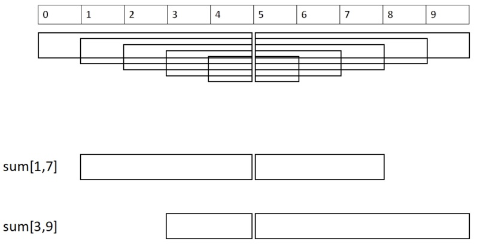
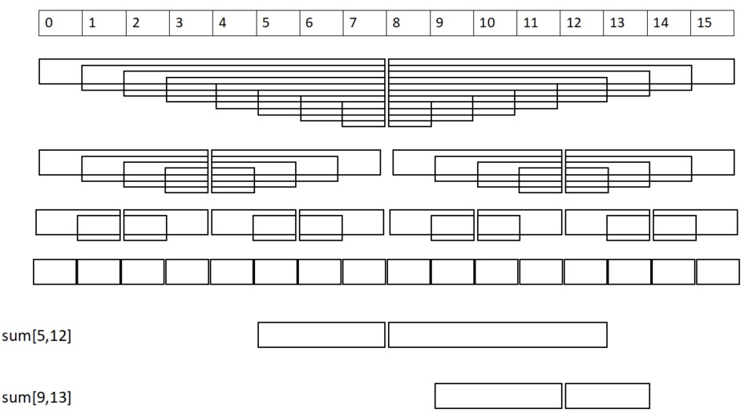

Данная структура избавится от требования к идемпотентности операции и даже ничем не пожертвует, по сравнению с обычным sparse table, за исключением сложности реализации! Таким образом, мы сильно расширим класс задач, которые можно решать за $O(1)$ на отрезке, но не стоит ограничиваться только подобными задачами - сама идея может быть применима и в задачах без запросов на отрезках.

Простейший пример новой задачи, которую мы сможем эффективно решать - это прозведение на отрезке по НЕПРОСТОМУ модулю.

## Идея

Мы научимся разбивать произвольный отрезок на всего лишь два непересекающих отрезка, которые в объединении дадут весь отрезок $[l, r]$. Однако не очевидно как это сделать.

Для начала научимся это делать для отрезков $[l, r]$, которые пересекают середину массива $m = \frac{n}{2}$. Для этого мы предпосчитаем сумму на всех возможных отрезках вида $[l, m]$ и $[m, r]$ и сохраним их в массивы $lm$ и $mr$. Так мы очевидным образом сможем разбить отрезок $[l, r]$ на два непересекающихся отрезка $[l, m]$ и $[m, r]$ и посчитать их сумму за $O(1)$.

{:width="50%"}

Обобщим идею на произвольные отрезки. Для этого рекурсивно построим такую же структуру на левой и правой частях массива и так далее. Таким образом, мы получим дерево (по сути дерево отрезков), в котором каждая вершина будет хранить массивы $lm$ и $mr$ для отрезков, которые она представляет. Благодаря такой рекурсивной структуре мы сможем разбивать произвольный отрезок $[l, r]$ на два непересекающихся отрезка $[l, m]$ и $[m, r]$ и посчитать их сумму за $O(1)$.

{:width="50%"}

## Важные детали

Как за $O(1)$ понять, в какую вершину disjoint sparse table дерева мы попали, чтобы из нее взять нужные массивы $lm$ и $mr$, иначе говоря как найти нужное центральное $m$?

Будем хранить всю структуру (предподсчитаные значения на отрезках) в массиве `t[logn][maxn]`, в котором первым параметром будет уровень в дереве отрезков (число $d$ для отрезков размера $2^d$), а вторым — граница соответствующего интервала (число $k$). Этой информации достаточно, чтобы однозначно восстановить отрезок.

Для ответа на запрос нам достаточно найти только уровень нужного центрального элемента. Чтобы научиться делать это эффективно, нам понадобится немного поразмышлять о природе дерева отрезков (=дерева disjoint sparse table).

Заметим, что любая вершина $k$-того уровня соответствует какому-то отрезку $[l, l+2^k)$, причём $l$ делится на $2^k$. Двоичное представление всех индексов на этом отрезке будет иметь какой-то общий префикс, а последние $k$ знаков будут различными.

Нам нужно найти уровень нужного центрального элемента — это то же самое, что и уровень наименьшего общего отрезка для элементов $l$ и $r$. Используя предыдущий факт, получаем, что искомый уровень будет равен позиции самого значимого бита, который отличается у чисел $l$ и $r$. Его можно найти за константное время выражением $h_{[l, r)} = \lfloor \log_2 (l \oplus r) \rfloor$.

## Ссылки

* [Disjoint Sparse Table объяснение](https://algorithmica.org/ru/sparse-table)
* [Disjoint Sparse Table картинки](https://noshi91.hatenablog.com/entry/2018/05/08/183946)
