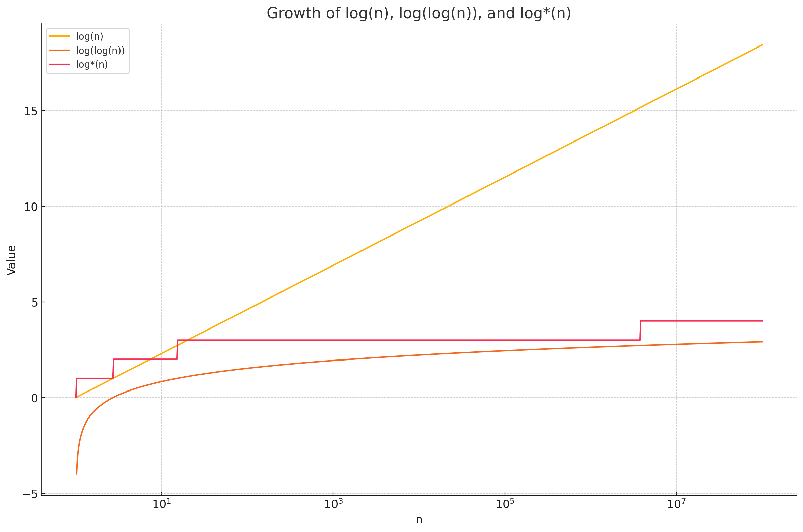
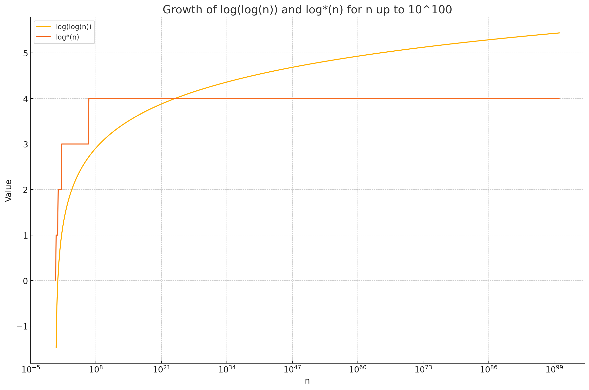

Данная структура не применима на олимпиадах, но полезна для образовательных целей. Я расскажу о крайне интересной идее о том, как можно сократить время предобработки и памяти до $O(n \log \log n)$, оставив запрос за $O(1)$. Далее мы расширим нашу идею и сделаем время предобработки $O(n \log^{ * } n)$ и запрос за $O(\log^{ * } n)$, где $\log^{ * } n$ - это количество логарифмов, которые нужно взять от $n$, чтобы получить число меньше или равное $1$ (невероятно медленно растущая функция, однако на практике такая оптимизация бесполезна!).

{:width="50%"}

{:width="50%"}

## Идея $O(n \log \log n)$

Разобьем массив на блоки длины $b = \log n$. Тогда структура данных будет состоять из двух частей:

1. Внутри каждого блока построим маленькую sparse table
2. Построим большую sparse table поверх блоков (то есть заменим блок на его минимум и на полученном массиве построим sparse table).

Теперь посчитаем асимптотику:

1. Для каждого блока размера $b$ мы будем строить sparse table, которая будет занимать $O(b \log b) = O(\log n \log \log n)$ памяти. Всего блоков будет $O(\frac{n}{b}) = O(\frac{n}{\log n})$. Таким образом, память на маленькие sparse table будет $O(\frac{n}{\log n} \cdot \log n \log \log n) = O(n \log \log n)$
2. Sparse table поверх блоков - это разреженная таблица на массиве длины $\frac{n}{b}$, то есть - $O(\frac{n}{b} \log \frac{n}{b}) = O(\frac{n}{\log n} \log \frac{n}{\log n}) = O(\frac{n}{\log n} \log n + \frac{n}{\log n} \log \log n) = O(n + n \log \log n) = O(n \log \log n)$
3. Запросы: всё ещё $O(1)$, так как мы можем разбить запрос на три части - суффикс некоторого блока, префикс некоторого блока и блоки между ними, минимум на каждой из частей можно найти за $O(1)$ за счет структур. Однако надо упомняуть, что есть случай, при котором запрос будет лежать внутри одного блока, но и этот случай выполняется за $O(1)$.

## Идея $O(n \log^{ * } n)$

Мы можем рекурсивно разбивать структуру на блоки, пока не дойдем до блоков размера $1$, таким образом мы получим $O(\log^{ * } n)$ уровней рекурсии. На каждом уровне рекурсии мы будем строить sparse table, которая будет занимать $O(n)$ памяти. Таким образом, память на всю структуру будет $O(n \log^{ * } n)$. Запросы будут выполняться за $O(\log^{ * } n)$, так как мы можем разбить запрос на $O(\log^{ * } n)$ частей.
